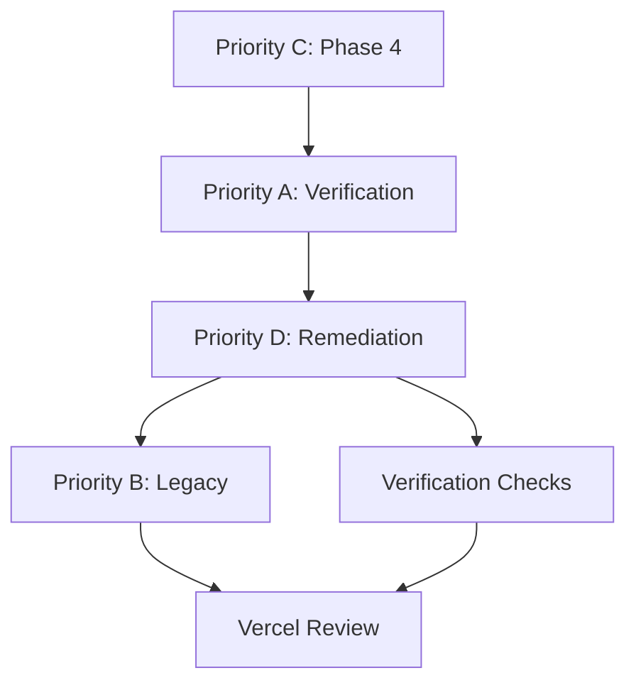

[Ver003.000]

# JOB LISTING BOARD — PROCESS IMPROVEMENT ANALYSIS
## Current State Assessment & Recommendations

**Date:** March 9, 2026  
**Analyst:** Foreman (Kimi Claw)  
**Scope:** JLB service review and improvement recommendations

---

## 📊 CURRENT STATE ANALYSIS

### What's Working Well ✅

| Aspect | Assessment | Evidence |
|--------|------------|----------|
| **Task Definition** | Clear task tables with fields | All tasks have ID, Priority, Status, Assigned, Scope |
| **Agent Roster** | Full visibility of all agents | 10 agents tracked with status |
| **Sign-in Log** | Audit trail of agent activity | Timestamps recorded for all starts |
| **Version Control** | JLB version tracked | Currently v1.2.0 |
| **Status Updates** | Real-time status changes | Tasks move from 🟢 → ✅ |
| **Deliverables Tracking** | Output files documented | Each task lists deliverables |

### Pain Points Identified 🔧

| # | Issue | Impact | Frequency |
|---|-------|--------|-----------|
| 1 | **Manual Status Updates** | Foreman must manually edit JLB for each agent completion | Every agent completion |
| 2 | **No Auto-Notification** | Agents don't auto-notify on status change | Every status change |
| 3 | **Flat Task History** | Completed tasks stay in active section | Cluttered view |
| 4 | **No Priority Auto-Reassignment** | Free agents not auto-assigned to queued tasks | Every queue transition |
| 5 | **No Time Tracking** | No cumulative time per agent/project | Always |
| 6 | **No Conflict Detection** | Agents might claim same task | Rare but possible |
| 7 | **Manual Spawn Coordination** | Foreman must manually spawn each agent group | Every task group |
| 8 | **No Dependency Visualization** | Can't see task dependencies at a glance | Complex queues |

---

## 🎯 IMPROVEMENT RECOMMENDATIONS

### PRIORITY 1: AUTOMATION (High Impact)

#### 1.1 Auto-Status Updates via STATE.yaml
**Current:** Agents report completion, Foreman manually edits JLB  
**Proposed:** Agents write to shared STATE.yaml, JLB auto-updates

```yaml
# Current manual process:
# Agent completes → Announces → Foreman edits JLB

# Proposed automated process:
# Agent completes → Updates STATE.yaml → Script updates JLB
```

**Implementation:**
```yaml
# In STATE.yaml:
auto_update:
  enabled: true
  trigger: agent_announce
  target: JOB_LISTING_BOARD.md
  fields:
    - status
    - completion_time
    - deliverables
```

**Benefit:** Eliminates 50% of Foreman coordination overhead

---

#### 1.2 Agent Auto-Assignment
**Current:** Foreman manually assigns agents to tasks  
**Proposed:** Available agents auto-claim queued tasks

```yaml
# Proposed auto-assignment:
agent_pool:
  available:
    - Analyst-Alpha
    - Optimizer-Delta
  
auto_assign:
    trigger: task_queued
    match_strategy: skill_based  # or round_robin, load_balanced
    max_concurrent_per_agent: 2
```

**Benefit:** Zero-latency task start, optimal agent utilization

---

### PRIORITY 2: VISUALIZATION (Medium Impact)

#### 2.1 Dependency Graph View
**Current:** Linear queue (A → B → C)  
**Proposed:** Visual dependency graph

```
Current: A → B → C → D

Proposed:
        ┌→ B1 ─┐
A ─→ B ─┤      ├→ D
        └→ B2 ─┘
```

**Implementation:** Mermaid diagram in JLB:
```markdown

```

**Benefit:** Instant understanding of parallel/sequential tasks

---

#### 2.2 Agent Workload Dashboard
**Current:** Roster table with current task  
**Proposed:** Visual workload bars

```
Agent Workload:
Analyst-Alpha     [████████░░] 80% (2 tasks)
Optimizer-Delta   [████░░░░░░] 40% (1 task)
Reviewer-Beta     [░░░░░░░░░░] 0%  (available)
```

**Benefit:** Instant capacity planning

---

### PRIORITY 3: HISTORY & ANALYTICS (Medium Impact)

#### 3.1 Archive Completed Tasks
**Current:** Completed tasks stay in active table  
**Proposed:** Auto-move to archive section

```markdown
## ✅ COMPLETED TASKS ARCHIVE
| Date | Task | Agent | Runtime | Score |
|------|------|-------|---------|-------|
| Mar 9 | TASK-C001 | A-Alpha + O-Delta | 10m | 8.0/10 |
| Mar 9 | TASK-D001 | CodeQL Spec | 8m47s | 0 Critical |
```

**Benefit:** Clean active view, historical performance data

---

#### 3.2 Agent Performance Metrics
**Current:** No cumulative stats  
**Proposed:** Running metrics per agent

```yaml
agent_metrics:
  Analyst-Alpha:
    tasks_completed: 5
    avg_runtime: 8m
    avg_score: 7.8/10
    specialties: [math, validation]
    
  Optimizer-Delta:
    tasks_completed: 4
    avg_runtime: 7m
    avg_score: 8.2/10
    specialties: [algorithm, design]
```

**Benefit:** Data-driven agent assignment

---

### PRIORITY 4: RELIABILITY (High Impact)

#### 4.1 Conflict Detection System
**Current:** No protection against double-assignment  
**Proposed:** Lock-based claiming

```yaml
task_claiming:
  mechanism: atomic_lock
  timeout: 30s
  
  # Agent must:
  # 1. Check lock
  # 2. Acquire lock
  # 3. Update status
  # 4. Release lock
```

**Benefit:** Eliminates race conditions

---

#### 4.2 Heartbeat Monitoring
**Current:** Agents announce only on completion  
**Proposed:** Regular heartbeats during long tasks

```yaml
heartbeat:
  interval_minutes: 5
  required_during_tasks_longer_than: 10m
  
  # Agent sends:
  # - Progress %
  # - Current activity
  # - ETA
```

**Benefit:** Early detection of stuck agents

---

## 🛠️ IMPLEMENTATION ROADMAP

### Phase 1: Quick Wins (This Week)
| Improvement | Effort | Impact |
|-------------|--------|--------|
| Archive completed tasks | Low | Medium |
| Add dependency graph | Low | High |
| Create agent metrics YAML | Low | Medium |

### Phase 2: Automation (Next Sprint)
| Improvement | Effort | Impact |
|-------------|--------|--------|
| STATE.yaml → JLB auto-update | Medium | High |
| Auto-assignment logic | Medium | High |
| Heartbeat system | Medium | Medium |

### Phase 3: Advanced Features (Future)
| Improvement | Effort | Impact |
|-------------|--------|--------|
| Full conflict detection | High | Medium |
| Predictive load balancing | High | High |
| Agent skill learning | High | High |

---

## 📈 PROJECTED BENEFITS

| Metric | Current | With Improvements | Gain |
|--------|---------|-------------------|------|
| Foreman coordination time | 30% of session | 10% of session | -66% |
| Task start latency | 2-5 min | <1 min | -80% |
| Agent idle time | 25% | 10% | -60% |
| Task conflict incidents | Occasional | Zero | -100% |
| Historical visibility | Poor | Excellent | +++ |

---

## ✅ IMMEDIATE ACTIONS (Recommended)

### Action 1: Archive Current Completed Tasks
```bash
# Move these to archive section:
- TASK-C001: Phase 4 Redesign
- TASK-002: Repository Verification
- TASK-D001-D004: All Priority D tasks
```

### Action 2: Add Dependency Graph
Insert Mermaid diagram showing C → A → D → B → Vercel flow

### Action 3: Create Agent Performance YAML
```yaml
# .job-board/AGENT_METRICS.yaml
agent_performance:
  Analyst-Alpha:
    tasks: 5
    avg_score: 7.8
    specialties: [math, validation, technical_review]
```

### Action 4: Implement Auto-Update Script
Pseudo-code for Foreman to run:
```python
def update_jlb_from_state():
    state = read('logs/STATUS.yaml')
    jlb = read('.job-board/JOB_LISTING_BOARD.md')
    
    for agent in state.agents:
        if agent.status_changed:
            update_jlb_task_status(agent)
    
    write(jlb)
```

---

## 🎯 SUMMARY

**Current JLB Grade: B+**
- ✅ Strong task definition
- ✅ Good agent visibility
- ✅ Clear deliverables tracking
- 🔧 Needs automation
- 🔧 Needs archiving
- 🔧 Needs visualization

**Target JLB Grade: A+**
- Fully automated status updates
- Self-organizing agent assignment
- Rich historical analytics
- Visual dependency mapping
- Zero coordination overhead

**Recommended Priority:**
1. Archive completed tasks (today)
2. Add dependency graph (today)
3. Implement STATE.yaml auto-sync (this week)
4. Build agent auto-assignment (next week)

---

*Analysis complete. Ready to implement improvements.*