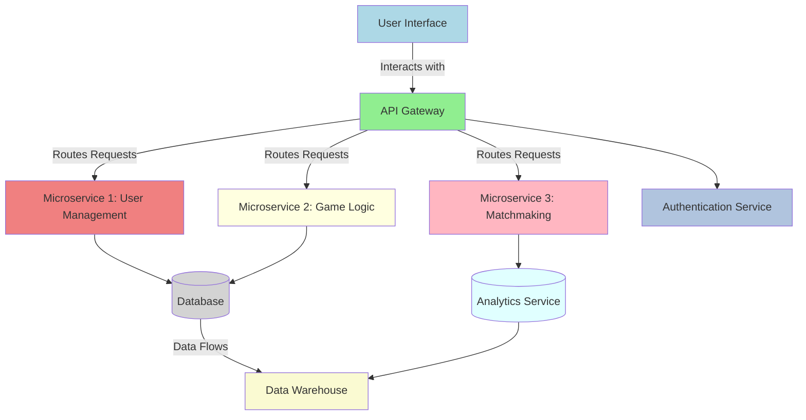

# NJZ eSports Platform Architecture

```mermaid
graph TD;
    A[User Interface] -->|Interacts with| B[API Gateway];
    B -->|Routes Requests| C[Microservice 1: User Management];
    B -->|Routes Requests| D[Microservice 2: Game Logic];
    B -->|Routes Requests| E[Microservice 3: Matchmaking];
    C --> F[(Database)];
    D --> F;
    E --> G[(Analytics Service)];
    F -->|Data Flows| H[Data Warehouse];
    G --> H;
    B --> I[Authentication Service];

    style A fill:lightblue;
    style B fill:lightgreen;
    style C fill:lightcoral;
    style D fill:lightyellow;
    style E fill:lightpink;
    style F fill:lightgray;
    style G fill:lightcyan;
    style H fill:lightgoldenrodyellow;
    style I fill:lightsteelblue;
```
