[Ver001.000] [Part: 1/1, Phase: 1/1, Progress: 100%, Status: Complete]

# CANONICAL SYSTEM ARCHITECTURE
## NJZiteGeisTe Platform - Consolidated Visual Reference

**Effective Date:** 2026-03-30  
**Version:** v2.1 Architecture  
**Status:** Canonical Truth

---

## 1. EXECUTIVE OVERVIEW

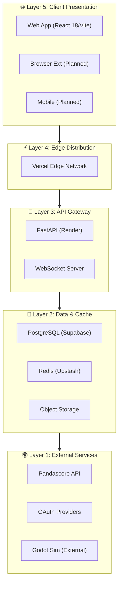

---

## 2. HUB ARCHITECTURE (TeNeT Gateway System)

The platform follows a **5-Hub Architecture** centered around the TeNeT (Temporal Network) gateway:

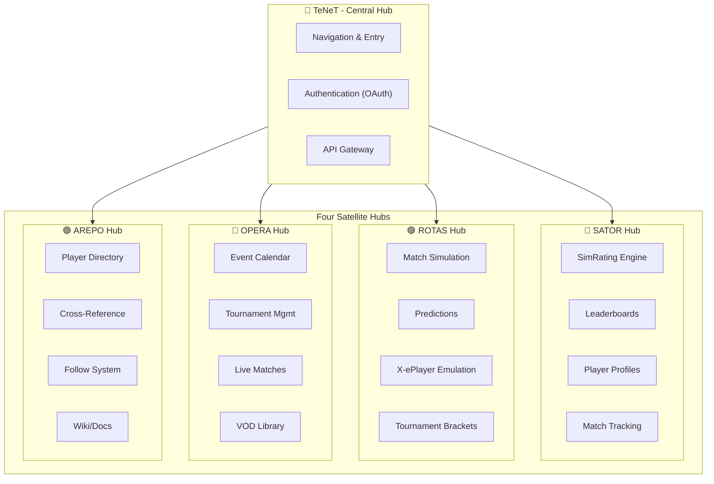

### Hub Responsibilities

| Hub | Domain | Key Components | Color Code |
|-----|--------|----------------|------------|
| **TeNeT** | Navigation & Auth | OAuth, JWT, Gateway | 🔶 Yellow |
| **SATOR** | Analytics & Observation | SimRating, Leaderboards | 🔴 Red |
| **ROTAS** | Simulation & Scheduling | Predictions, X-ePlayer | 🟢 Green |
| **OPERA** | Operations & Events | Tournaments, Calendar | 🔵 Blue |
| **AREPO** | Repository & Storage | Directory, Wiki | 🟣 Purple |

---

## 3. DATA NETWORKS (Geist Infrastructure)

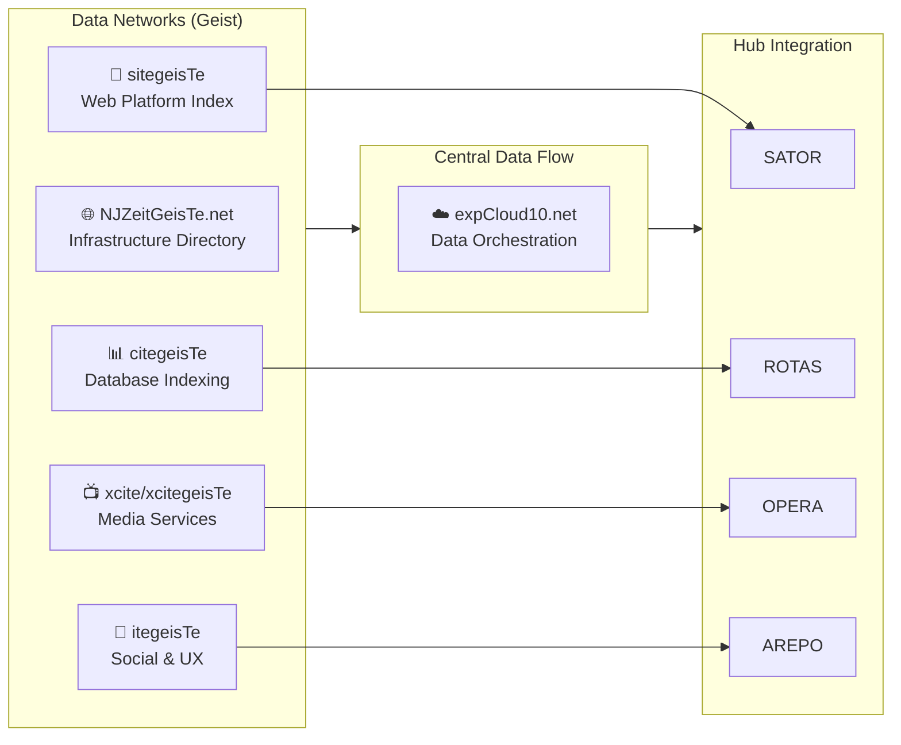

### Network Mappings

| Network | Hub Mapping | Function | Repository Path |
|---------|-------------|----------|-----------------|
| **sitegeisTe** | SATOR | Web Platform Index | `apps/web/src/hub-1-sator/` |
| **citegeisTe** | ROTAS | Database Indexing | `apps/web/src/hub-2-rotas/` |
| **xcite** | OPERA | Media Services | `apps/web/src/hub-4-opera/` |
| **itegeisTe** | AREPO | Social/UX | `apps/web/src/hub-3-arepo/` |
| **NJZeitGeisTe** | ALL | Infrastructure | `packages/shared/api/` |

---

## 4. SIMULATION ECOSYSTEM

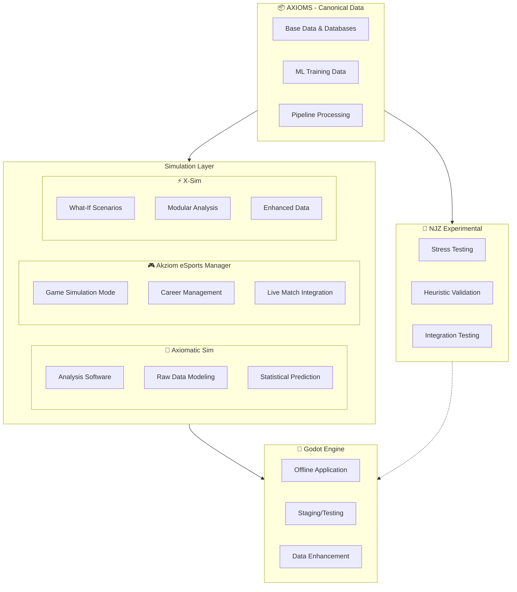

### Simulation Distinctions

| Component | Type | Purpose | User Access |
|-----------|------|---------|-------------|
| **Axiomatic Sim** | Analysis Software | Data analysis, NOT a game | Web Platform |
| **Akziom/eSim** | Video Game | Full game simulation experience | Standalone App |
| **X-Sim** | Extended Simulation | What-if scenarios, predictive analytics | Web Platform |
| **Godot Engine** | Runtime | Execution environment for simulations | Backend |

**Key Principle:** *Axiomatic Sim ≠ Video Game. Software uses data FOR analysis. Akziom/eSim IS the Video Game. Shared data, different purposes.*

---

## 5. SERVICE EXTENSIONS & INTEGRATIONS

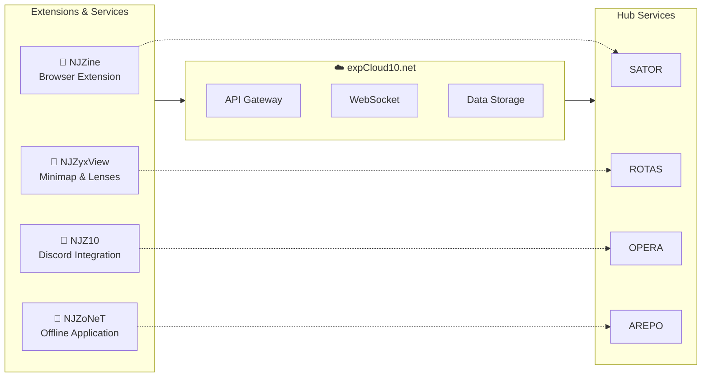

### Extension Status

| Extension | Status | Hub | Repository Path |
|-----------|--------|-----|-----------------|
| **NJZine** | 🟡 Planned | SATOR | `apps/browser-extension/` |
| **NJZyxView** | 🟡 Planned | ROTAS | Future: Overlay feature |
| **NJZ10** | 🟡 Planned | OPERA | Discord bot (future) |
| **NJZoNeT** | 🟡 Planned | AREPO | Desktop app (Tauri/Electron) |

---

## 6. TECHNOLOGY STACK MAPPING

### Repository Structure (Canonical)

```
eSports-EXE/
│
├── 📁 apps/                          # Client Applications
│   ├── 🌐 web/                      # Main Web Platform (React 18 + Vite)
│   │   ├── src/
│   │   │   ├── hub-1-sator/        # 🔴 Analytics & Leaderboards
│   │   │   ├── hub-2-rotas/        # 🟢 Simulation & Predictions
│   │   │   ├── hub-3-arepo/        # 🟣 Directory & Wiki
│   │   │   ├── hub-4-opera/        # 🔵 Tournaments & Events
│   │   │   ├── hub-5-tenet/        # 🔶 Navigation & Auth
│   │   │   └── hub-cs2/            # 🎮 Counter-Strike 2 Hub
│   │   └── package.json
│   │
│   ├── 🔌 browser-extension/        # 🟡 NJZine (Planned)
│   └── 📊 VCT Valorant eSports/     # Standalone data project
│
├── 📦 packages/                      # Shared Packages
│   └── 🔧 shared/
│       ├── api/                     # FastAPI Backend
│       │   ├── src/
│       │   │   ├── auth/           # TeXeT Keys App (OAuth)
│       │   │   ├── rotas/          # Simulation API
│       │   │   ├── sator/          # Analytics API
│       │   │   └── notifications/  # Push service
│       │   └── requirements.txt
│       │
│       └── axiom-esports-data/      # Data Pipeline
│
├── 🎮 platform/                      # Simulation Platform
│   └── simulation-game/            # Godot 4 (To be extracted)
│
├── 📁 docs/                          # Documentation
│   ├── architecture/               # This document
│   ├── API_V1_DOCUMENTATION.md
│   └── DEPLOYMENT_GUIDE.md
│
├── 🔬 tests/                         # Test Suites
│   ├── e2e/                        # Playwright
│   ├── integration/                # Python
│   └── simulation/                 # ROTAS validation
│
└── ⚙️ .github/workflows/            # CI/CD
    ├── ci.yml
    ├── security-scan.yml
    └── deploy.yml
```

### Technology by Layer

| Layer | Technology | Version | Purpose |
|-------|------------|---------|---------|
| **Frontend** | React + Vite | 18 / 5 | Web platform |
| **Styling** | Tailwind CSS | 3.x | UI components |
| **State** | Zustand + TanStack Query | 4.x / 5.x | State management |
| **Backend** | FastAPI | 0.115+ | API server |
| **Database** | PostgreSQL | 15+ | Primary storage |
| **Cache** | Redis | 7+ | Session/cache |
| **ML** | TensorFlow.js | 4.x | SimRating model |
| **Simulation** | Godot 4 | 4.2+ | Match simulation |
| **Testing** | Playwright + pytest | Latest | E2E + unit |
| **Hosting** | Vercel + Render | — | Edge + API |

---

## 7. AUTHENTICATION FLOW (TeXeT Keys App)

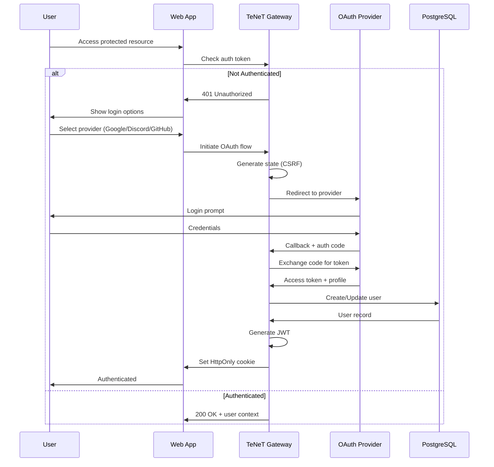

### Security Layers

| Layer | Component | Implementation |
|-------|-----------|----------------|
| **Transport** | HTTPS | TLS 1.3 required |
| **Session** | JWT | HttpOnly, SameSite=Lax |
| **CSRF** | State Parameter | cryptographically random |
| **Rate Limit** | SlowAPI | 100 req/min per IP |
| **Audit** | Logging | All auth events logged |

---

## 8. DATA FLOW: SATOR Analytics Pipeline

```mermaid
flowchart LR
    subgraph Input["📥 Input Sources"]
        Pandascore["Pandascore API"]
        UserData["User Predictions"]
        Manual["Manual Entry"]
    end
    
    subgraph Ingestion["🔄 Ingestion Layer"]
        ETL["ETL Pipeline"]
        CB["Circuit Breaker"]
        Cache["Redis Cache"]
    end
    
    subgraph Processing["⚙️ Processing"]
        Normalize["Normalization"]
        SimRating["SimRating v2 Engine"]
        Confidence["Confidence Scoring"]
        ML["ML Ranking Model"]
    end
    
    subgraph Output["📤 Output"]
        API["/v1/analytics"]
        Leaderboard["Leaderboards"]
        Profile["Player Profiles"]
    end
    
    Input --> Ingestion --> Processing --> Output
```

### Pipeline Stages

| Stage | Input | Output | Latency |
|-------|-------|--------|---------|
| **Ingestion** | Pandascore webhook | Raw events | Real-time |
| **ETL** | Raw events | Normalized stats | ~5 min |
| **SimRating** | Player stats | Rating scores | ~1 min |
| **Ranking** | All ratings | Leaderboards | ~5 min |

---

## 9. DATA FLOW: ROTAS Simulation Pipeline

```mermaid
flowchart LR
    subgraph Request["🎯 Simulation Request"]
        Teams["Team Compositions"]
        Maps["Map Selection"]
        Econ["Economy State"]
        Options["Sim Options"]
    end
    
    subgraph Engine["🎮 ROTAS Engine"]
        Deterministic["Deterministic Run"]
        Validation["Validation Check"]
        XePlayer["X-ePlayer Emulation"]
    end
    
    subgraph Output["📊 Output"]
        Winner["Predicted Winner"]
        Score["Predicted Score"]
        Rounds["Round-by-Round"]
        Confidence["Confidence %"]
    end
    
    Request --> Engine --> Output
```

### Simulation Accuracy Targets

| Metric | Target | Minimum | Validation Method |
|--------|--------|---------|-------------------|
| Match Winner | 70% | 65% | VCT Historical |
| Exact Score | 60% | 55% | VCT Historical |
| Round Winner | 55% | 50% | VCT Historical |
| Determinism | 100% | 100% | Unit Tests |

---

## 10. CIRCUIT BREAKER ARCHITECTURE

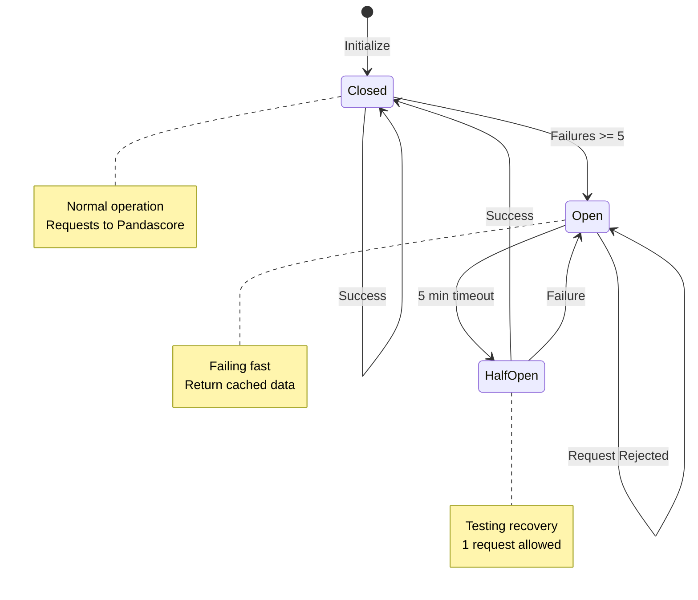

### Circuit Breaker Configuration

| Service | Threshold | Timeout | Fallback |
|---------|-----------|---------|----------|
| **Pandascore** | 5 failures | 5 min | Cached data |
| **Redis** | 3 failures | 30 sec | Direct DB |
| **OAuth** | 3 failures | 1 min | Error page |

---

## 11. DEPLOYMENT ARCHITECTURE

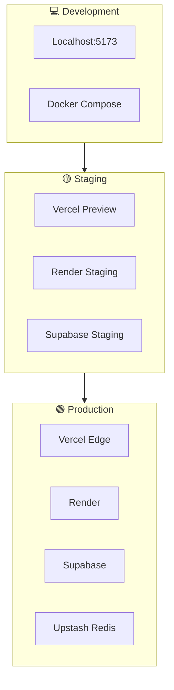

### Infrastructure Mapping

| Component | Development | Staging | Production |
|-----------|-------------|---------|------------|
| **Frontend** | localhost:5173 | Preview URL | Vercel Edge |
| **API** | localhost:8000 | Render Staging | Render |
| **Database** | Docker | Supabase Staging | Supabase |
| **Cache** | Docker | Upstash | Upstash |
| **Storage** | Local | Supabase | Supabase |

---

## 12. API VERSIONING & ENDPOINTS

### Current API Structure

```
https://api.njzitegeist.com/v1/
│
├── 🔐 /auth
│   ├── POST /token
│   ├── GET /oauth/{provider}
│   └── POST /2fa/verify
│
├── 👤 /players
│   ├── GET / (list)
│   ├── GET /{id}
│   ├── GET /{id}/stats
│   └── GET /{id}/history
│
├── 🎮 /matches
│   ├── GET / (list)
│   ├── GET /{id}
│   └── GET /{id}/stats
│
├── 📊 /analytics
│   ├── GET /simrating
│   ├── GET /leaderboard
│   └── GET /predictions
│
├── 🔮 /rotas
│   ├── POST /simulate
│   ├── GET /predictions/{match_id}
│   └── GET /brackets/{tournament_id}
│
├── 🔍 /search
│   └── GET /?q={query}
│
└── 🏥 /health
    ├── GET / (basic)
    ├── GET /ready
    └── GET /circuits
```

### Versioning Policy

| Version | Status | Support Until | Breaking Changes |
|---------|--------|---------------|------------------|
| v1 | ✅ STABLE | 2027-03-30 | None (6mo notice) |
| v2 | ⬜ PLANNED | TBD | TBD |

---

## 13. SECURITY ARCHITECTURE

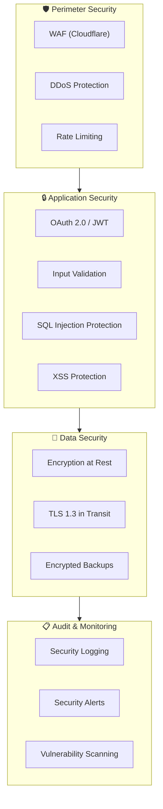

### Security Checklist (Pre-Production)

- [x] OAuth 2.0 with state validation
- [x] JWT with HttpOnly cookies
- [x] Rate limiting (SlowAPI)
- [x] Input validation (Pydantic)
- [x] SQL injection protection (SQLAlchemy)
- [ ] Third-party security audit
- [ ] Penetration testing
- [ ] SOC 2 compliance review

---

## 14. MONITORING & OBSERVABILITY

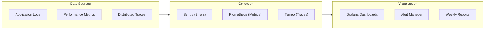

### Key Metrics

| Metric | Target | Alert Threshold |
|--------|--------|-----------------|
| **API Latency** | <200ms p99 | >500ms |
| **Error Rate** | <0.1% | >1% |
| **Uptime** | 99.9% | <99.5% |
| **Cache Hit Rate** | >80% | <60% |

---

## 15. GLOSSARY

| Term | Definition |
|------|------------|
| **TeNeT** | Temporal Network - Central navigation gateway |
| **TeXeT** | Keys Application - Authentication layer |
| **TeZeT** | Data Center Connector - API gateway |
| **SATOR** | Analytics & Observation Hub |
| **ROTAS** | Return On Tactical Analysis System - Simulation |
| **OPERA** | Operations & Event Management Hub |
| **AREPO** | Repository & Storage Hub |
| **Geist** | Data network infrastructure layer |
| **Axioms** | Canonical data foundation |
| **X-ePlayer** | User-match-history-based AI emulation |
| **SimRating** | Player performance rating algorithm |
| **RAR** | Risk-Adjusted Return - Investment grading |

---

## 16. DOCUMENT CONTROL

| Version | Date | Author | Changes |
|---------|------|--------|---------|
| 001.000 | 2026-03-30 | Architecture Team | Initial consolidated version |

### Related Documents

- [API Documentation](../API_V1_DOCUMENTATION.md)
- [Deployment Guide](../DEPLOYMENT_GUIDE.md)
- [Security Policy](../../SECURITY.md)
- [Data Architecture](../DATA_ARCHITECTURE.md)

### Review Cycle

- **Quarterly:** Architecture review
- **After Major Changes:** Immediate update
- **Annual:** Comprehensive audit

---

*End of Canonical System Architecture*  
*This document represents the authoritative source of truth for NJZiteGeisTe Platform architecture.*
