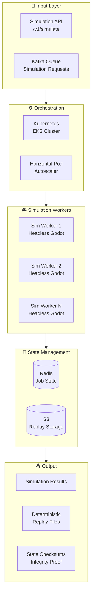
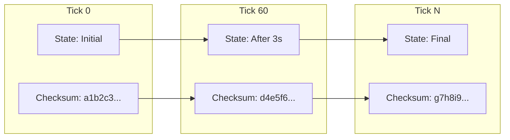

[Ver001.000] [Part: 1/1, Phase: 2/3, Progress: 10%, Status: On-Going]

# Cloud-Native Simulation Engine Rewrite
## Decoupled, Headless, Deterministic Architecture

---

## 1. EXECUTIVE SUMMARY

**Objective:** Transform the Godot simulation engine into a cloud-native, horizontally scalable service with deterministic replay capabilities.

**Current State:**
- Monolithic Godot project in platform/simulation-game/
- GUI-dependent execution
- Single-player local execution only
- No cloud deployment capability

**Target State:**
- Headless Linux builds for AWS EC2/EKS
- Containerized microservice architecture
- Deterministic replay with state checksums
- Comparable to MLB's pitch replay verification system

---

## 2. ARCHITECTURE OVERVIEW



---

## 3. HEADLESS GODOT BUILD

### 3.1 Export Configuration

```json
// platform/simulation-game/export_presets.cfg
[preset.0]
name="Linux/X11 Headless"
platform="Linux/X11"
Runnable=true
CustomFeatures="headless;server"
ExportFilter="all_resources"
ExportMode=1

[preset.0.options]
CustomTemplate/Path=""
CustomTemplate/Release=""
BinaryFormat/Architecture=0
SSHRemoteDeploy/Host=""
SSHRemoteDeploy/Port=22

// Headless-specific settings
application/run/main_loop_type="SceneTree"
application/config/disable_stdout=false
application/config/disable_stderr=false

// No window/GUI
Display/Window/Mode=4  // WindowMode.MODE_MINIMIZED
Display/Window/Size/Width=1
Display/Window/Size/Height=1
```

### 3.2 Headless Entry Point

```gdscript
# platform/simulation-game/scripts/headless_server.gd
extends SceneTree

"""
Headless simulation server for cloud deployment.
Runs without GUI, accepts simulation jobs via API.
"""

const SimulationEngine = preload("res://scripts/simulation_engine.gd")
const StateManager = preload("res://scripts/state_manager.gd")

var http_server: HTTPServer
var port: int = 8080
var current_job: Dictionary = {}

func _initialize():
    print("🎮 ROTAS Simulation Server (Headless)")
    print("Version: 2.1.0")
    print("Mode: Cloud-Native")
    
    # Initialize deterministic RNG
    seed(0)  # Will be overridden per-job
    
    # Start HTTP server for job reception
    http_server = HTTPServer.new()
    http_server.listen(port)
    http_server.request_ready.connect(_on_request)
    
    print("✅ Server ready on port %d" % port)

func _on_request():
    var request = http_server.take_request()
    if not request:
        return
    
    match request.method:
        "POST":
            match request.url:
                "/simulate":
                    _handle_simulate(request)
                "/replay":
                    _handle_replay(request)
                "/health":
                    _handle_health(request)
                _:
                    _send_error(request, 404, "Not found")
        "GET":
            match request.url:
                "/health":
                    _handle_health(request)
                _:
                    _send_error(request, 404, "Not found")
        _:
            _send_error(request, 405, "Method not allowed")

func _handle_simulate(request: HTTPRequest):
    """Handle simulation request."""
    var body = request.get_body()
    var json = JSON.parse_string(body.get_string_from_utf8())
    
    if not json:
        _send_error(request, 400, "Invalid JSON")
        return
    
    # Validate input
    var validation = _validate_simulation_input(json)
    if not validation.valid:
        _send_error(request, 400, validation.error)
        return
    
    # Extract parameters
    var match_config = json.match_config
    var job_id = json.get("job_id", _generate_job_id())
    var seed = json.get("seed", randi())
    
    print("🎯 Starting simulation job: %s" % job_id)
    
    # Run simulation deterministically
    var result = _run_simulation(match_config, seed, job_id)
    
    # Send response
    var response = {
        "job_id": job_id,
        "status": "completed",
        "result": result.summary,
        "checksum": result.checksum,
        "replay_url": result.replay_url,
        "duration_ms": result.duration_ms
    }
    
    _send_json(request, 200, response)

func _run_simulation(config: Dictionary, seed: int, job_id: String) -> Dictionary:
    """
    Run deterministic simulation with full state tracking.
    
    Returns:
        Dictionary with summary, checksum, and replay data
    """
    var start_time = Time.get_ticks_msec()
    
    # Set deterministic seed
    seed(seed)
    
    # Initialize engine
    var engine = SimulationEngine.new()
    engine.initialize(config)
    
    # State tracking for replay
    var state_log: Array = []
    var checksums: Array = []
    
    # Run simulation tick by tick
    while not engine.is_finished():
        var tick = engine.get_current_tick()
        
        # Record state at key intervals
        if tick % 60 == 0:  # Every 60 ticks (~3 seconds)
            var state = engine.capture_state()
            state_log.append({
                "tick": tick,
                "state": state,
                "timestamp": Time.get_ticks_msec()
            })
            
            # Calculate state checksum
            var checksum = _calculate_checksum(state)
            checksums.append({"tick": tick, "checksum": checksum})
        
        # Advance simulation
        engine.tick(1.0 / 20.0)  # 20 TPS
    
    # Final results
    var summary = engine.get_results()
    var final_checksum = _calculate_checksum(summary)
    
    # Save replay to S3
    var replay_url = _save_replay(job_id, {
        "job_id": job_id,
        "seed": seed,
        "config": config,
        "state_log": state_log,
        "checksums": checksums,
        "final_checksum": final_checksum,
        "summary": summary
    })
    
    return {
        "summary": summary,
        "checksum": final_checksum,
        "replay_url": replay_url,
        "duration_ms": Time.get_ticks_msec() - start_time
    }

func _calculate_checksum(state: Dictionary) -> String:
    """
    Calculate deterministic checksum of state.
    Used for integrity verification and replay validation.
    """
    var json_string = JSON.stringify(state)
    var ctx = HashingContext.new()
    ctx.start(HashingContext.HASH_SHA256)
    ctx.update(json_string.to_utf8_buffer())
    return ctx.finish().hex_encode()

func _save_replay(job_id: String, replay_data: Dictionary) -> String:
    """Save replay to S3-compatible storage."""
    # Implementation depends on S3 client
    var s3_key = "replays/%s.json.gz" % job_id
    # ... upload to S3 ...
    return "s3://njz-replays/%s" % s3_key

func _handle_replay(request: HTTPRequest):
    """Replay a simulation for verification."""
    var body = JSON.parse_string(request.get_body().get_string_from_utf8())
    var job_id = body.get("job_id")
    
    # Load original replay
    var original = _load_replay(job_id)
    
    # Re-run with same seed
    var rerun = _run_simulation(
        original.config,
        original.seed,
        job_id + "_replay"
    )
    
    # Compare checksums
    var verified = (rerun.checksum == original.final_checksum)
    
    _send_json(request, 200, {
        "job_id": job_id,
        "verified": verified,
        "original_checksum": original.final_checksum,
        "replay_checksum": rerun.checksum,
        "match": verified
    })

func _handle_health(request: HTTPRequest):
    """Health check endpoint."""
    _send_json(request, 200, {
        "status": "healthy",
        "version": "2.1.0",
        "mode": "headless",
        "current_job": current_job.get("job_id", null)
    })

func _send_json(request: HTTPRequest, code: int, data: Dictionary):
    var body = JSON.stringify(data).to_utf8_buffer()
    request.send_response(code, "OK", body.size())
    request.send_body(body)

func _send_error(request: HTTPRequest, code: int, message: String):
    _send_json(request, code, {"error": message})

func _generate_job_id() -> String:
    return "sim_%d_%d" % [Time.get_unix_time_from_system(), randi()]

func _validate_simulation_input(json: Dictionary) -> Dictionary:
    """Validate simulation request input."""
    if not json.has("match_config"):
        return {valid = false, error = "Missing match_config"}
    
    var config = json.match_config
    if not config.has("team_a") or not config.has("team_b"):
        return {valid = false, error = "Missing team configurations"}
    
    return {valid = true}
```

---

## 4. CONTAINERIZATION

### 4.1 Dockerfile

```dockerfile
# Dockerfile.simulation
# Headless Godot simulation server

FROM ubuntu:22.04 AS base

# Install dependencies
RUN apt-get update && apt-get install -y \
    ca-certificates \
    wget \
    unzip \
    libgl1-mesa-glx \
    libxcursor1 \
    libxinerama1 \
    libxrandr2 \
    libxi6 \
    libasound2 \
    && rm -rf /var/lib/apt/lists/*

# Download Godot 4.2.1 server build
ENV GODOT_VERSION=4.2.1
RUN wget https://downloads.tuxfamily.org/godotengine/${GODOT_VERSION}/Godot_v${GODOT_VERSION}-stable_linux.x86_64.zip \
    && unzip Godot_v${GODOT_VERSION}-stable_linux.x86_64.zip \
    && mv Godot_v${GODOT_VERSION}-stable_linux.x86_64 /usr/local/bin/godot \
    && chmod +x /usr/local/bin/godot \
    && rm *.zip

# Production stage
FROM base AS production

WORKDIR /app

# Copy project files
COPY platform/simulation-game/project.godot ./
COPY platform/simulation-game/scripts ./scripts
COPY platform/simulation-game/entities ./entities
COPY platform/simulation-game/maps ./maps
COPY platform/simulation-game/Defs ./Defs

# Export headless build
RUN mkdir -p build
RUN godot --headless --export-release "Linux/X11 Headless" build/simulation_server

# Runtime
EXPOSE 8080

HEALTHCHECK --interval=30s --timeout=5s --start-period=10s --retries=3 \
    CMD curl -f http://localhost:8080/health || exit 1

CMD ["./build/simulation_server", "--headless"]
```

### 4.2 Kubernetes Deployment

```yaml
# infrastructure/k8s/simulation-deployment.yaml
apiVersion: apps/v1
kind: Deployment
metadata:
  name: rotas-simulation
  labels:
    app: rotas-simulation
spec:
  replicas: 3
  selector:
    matchLabels:
      app: rotas-simulation
  template:
    metadata:
      labels:
        app: rotas-simulation
    spec:
      containers:
      - name: simulation
        image: njzitegeist/rotas-simulation:2.1.0
        ports:
        - containerPort: 8080
          name: http
        env:
        - name: GODOT_MODE
          value: "headless"
        - name: LOG_LEVEL
          value: "info"
        resources:
          requests:
            memory: "512Mi"
            cpu: "500m"
          limits:
            memory: "2Gi"
            cpu: "2000m"
        livenessProbe:
          httpGet:
            path: /health
            port: 8080
          initialDelaySeconds: 30
          periodSeconds: 10
        readinessProbe:
          httpGet:
            path: /health
            port: 8080
          initialDelaySeconds: 5
          periodSeconds: 5
---
apiVersion: v1
kind: Service
metadata:
  name: rotas-simulation
spec:
  selector:
    app: rotas-simulation
  ports:
  - port: 80
    targetPort: 8080
  type: ClusterIP
---
apiVersion: autoscaling/v2
kind: HorizontalPodAutoscaler
metadata:
  name: rotas-simulation-hpa
spec:
  scaleTargetRef:
    apiVersion: apps/v1
    kind: Deployment
    name: rotas-simulation
  minReplicas: 3
  maxReplicas: 50
  metrics:
  - type: Resource
    resource:
      name: cpu
      target:
        type: Utilization
        averageUtilization: 70
  - type: Resource
    resource:
      name: memory
      target:
        type: Utilization
        averageUtilization: 80
  behavior:
    scaleUp:
      stabilizationWindowSeconds: 60
      policies:
      - type: Percent
        value: 100
        periodSeconds: 15
    scaleDown:
      stabilizationWindowSeconds: 300
      policies:
      - type: Percent
        value: 10
        periodSeconds: 60
```

---

## 5. DETERMINISTIC REPLAY SYSTEM

### 5.1 State Checksum Architecture



### 5.2 Replay Verification

```python
# packages/shared/api/src/simulation/replay_verifier.py
"""
Deterministic replay verification for esports integrity.
Comparable to MLB's pitch replay verification system.
"""
import hashlib
import json
from typing import List, Dict, Tuple
from dataclasses import dataclass


@dataclass
class ChecksumPoint:
    tick: int
    checksum: str
    timestamp: float


class ReplayVerifier:
    """
    Verify simulation integrity through deterministic replay.
    """
    
    def __init__(self, simulation_service_url: str):
        self.service_url = simulation_service_url
    
    async def verify_simulation(
        self,
        job_id: str,
        tolerance_ticks: int = 0
    ) -> Dict[str, any]:
        """
        Verify simulation by re-running with same inputs.
        
        Args:
            job_id: Original simulation job ID
            tolerance_ticks: Allowed tick drift (0 for exact match)
            
        Returns:
            Verification result with match status
        """
        # Load original replay
        original = await self._load_replay(job_id)
        
        # Request replay from simulation service
        replay_result = await self._request_replay(
            config=original["config"],
            seed=original["seed"]
        )
        
        # Compare final checksums
        final_match = (
            original["final_checksum"] == replay_result["checksum"]
        )
        
        # Compare intermediate checksums (if tolerance > 0)
        intermediate_matches = self._compare_checksums(
            original["checksums"],
            replay_result["checksums"],
            tolerance_ticks
        )
        
        return {
            "job_id": job_id,
            "verified": final_match and intermediate_matches["valid"],
            "final_checksum_match": final_match,
            "intermediate_checks": intermediate_matches,
            "original_duration_ms": original.get("duration_ms"),
            "replay_duration_ms": replay_result["duration_ms"],
            "determinism_score": self._calculate_determinism_score(
                original["checksums"],
                replay_result["checksums"]
            )
        }
    
    def _compare_checksums(
        self,
        original: List[ChecksumPoint],
        replay: List[ChecksumPoint],
        tolerance: int
    ) -> Dict[str, any]:
        """Compare checksum sequences with optional tolerance."""
        matches = 0
        mismatches = []
        
        for orig in original:
            # Find matching tick in replay (with tolerance)
            found = False
            for rep in replay:
                if abs(rep.tick - orig.tick) <= tolerance:
                    if rep.checksum == orig.checksum:
                        matches += 1
                        found = True
                    else:
                        mismatches.append({
                            "tick": orig.tick,
                            "original": orig.checksum,
                            "replay": rep.checksum
                        })
                    break
            
            if not found:
                mismatches.append({
                    "tick": orig.tick,
                    "error": "No matching tick found"
                })
        
        total = len(original)
        return {
            "valid": len(mismatches) == 0,
            "match_rate": matches / total if total > 0 else 0,
            "matches": matches,
            "total": total,
            "mismatches": mismatches[:10]  # Limit details
        }
    
    def _calculate_determinism_score(
        self,
        original: List[ChecksumPoint],
        replay: List[ChecksumPoint]
    ) -> float:
        """
        Calculate overall determinism score (0-100).
        
        100 = Perfect determinism
        0 = Completely non-deterministic
        """
        if len(original) != len(replay):
            return 0.0
        
        matches = sum(
            1 for o, r in zip(original, replay)
            if o.checksum == r.checksum
        )
        
        return (matches / len(original)) * 100


class IntegrityMonitor:
    """
    Continuous monitoring of simulation integrity.
    """
    
    ALERT_THRESHOLD = 95.0  # Trigger alert if determinism < 95%
    
    async def check_batch_integrity(
        self,
        job_ids: List[str]
    ) -> Dict[str, any]:
        """Verify integrity of recent simulations."""
        verifier = ReplayVerifier("http://simulation-service:8080")
        
        results = []
        for job_id in job_ids:
            result = await verifier.verify_simulation(job_id)
            results.append(result)
        
        # Calculate batch statistics
        scores = [r["determinism_score"] for r in results]
        avg_score = sum(scores) / len(scores) if scores else 0
        
        # Alert if below threshold
        if avg_score < self.ALERT_THRESHOLD:
            await self._send_integrity_alert(avg_score, results)
        
        return {
            "batch_size": len(job_ids),
            "average_determinism": avg_score,
            "verified_count": sum(1 for r in results if r["verified"]),
            "failed_count": sum(1 for r in results if not r["verified"]),
            "requires_investigation": avg_score < self.ALERT_THRESHOLD
        }
    
    async def _send_integrity_alert(
        self,
        score: float,
        results: List[Dict]
    ):
        """Send alert for integrity issues."""
        # PagerDuty / Slack integration
        pass
```

---

## 6. IMPLEMENTATION TIMELINE

### Phase 1: Headless Build (Week 1-2)
- [ ] Configure Godot headless export
- [ ] Implement HTTP server in GDScript
- [ ] Add state checkpointing
- [ ] Build container image

### Phase 2: Cloud Deployment (Week 3-4)
- [ ] Create Kubernetes manifests
- [ ] Configure HPA
- [ ] Set up S3 replay storage
- [ ] Implement health checks

### Phase 3: Determinism (Week 5-6)
- [ ] Implement state checksums
- [ ] Build replay verification system
- [ ] Add integrity monitoring
- [ ] Stress test determinism

### Phase 4: Integration (Week 7-8)
- [ ] Connect to Kafka pipeline
- [ ] Implement job queue
- [ ] Add scaling policies
- [ ] Production deployment

---

## 7. MLB-STYLE INTEGRITY COMPARISON

| Feature | MLB Pitch Replay | ROTAS Simulation |
|---------|------------------|------------------|
| **Purpose** | Verify pitch calls | Verify match predictions |
| **Input** | Video + sensors | Match config + seed |
| **Output** | Safe/Out call | Winner prediction |
| **Determinism** | Frame-by-frame replay | Tick-by-tick replay |
| **Checksum** | Video hash | State hash |
| **Verification** | Multi-angle replay | Re-run with same seed |
| **Dispute Resolution** | Umpire review | Automated replay |

---

## 8. DOCUMENT CONTROL

| Version | Date | Author | Changes |
|---------|------|--------|---------|
| 001.000 | 2026-03-30 | Platform Team | Cloud-native rewrite plan |

---

*End of Cloud-Native Simulation Rewrite*
