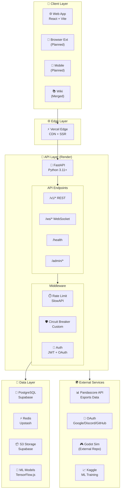
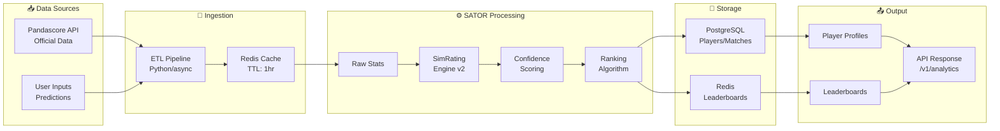
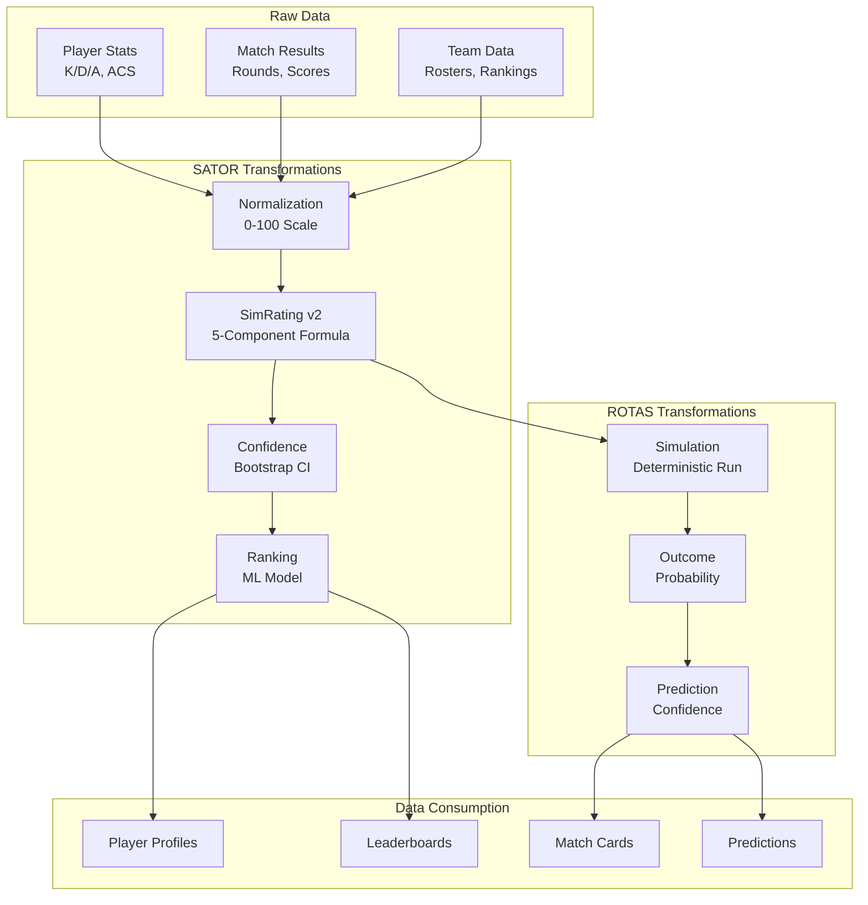
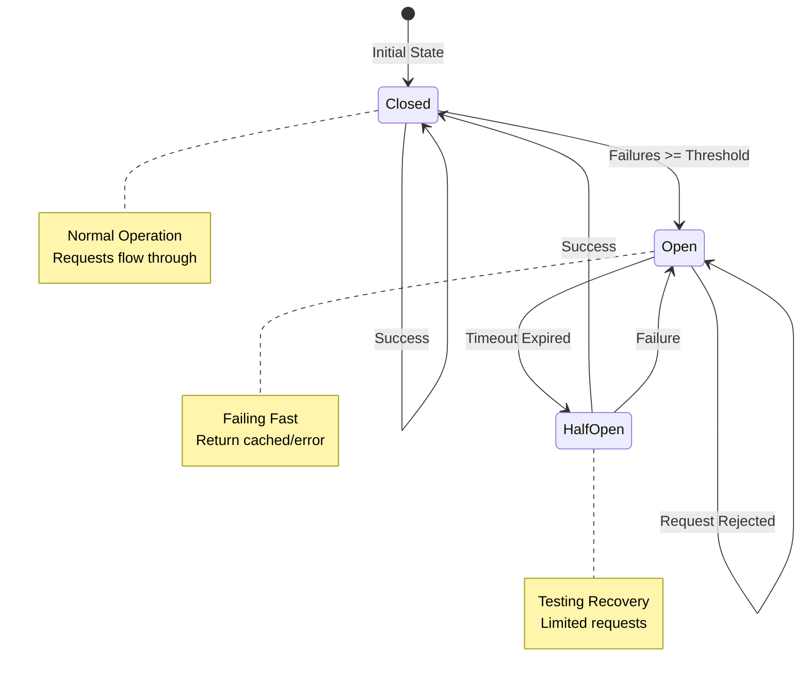
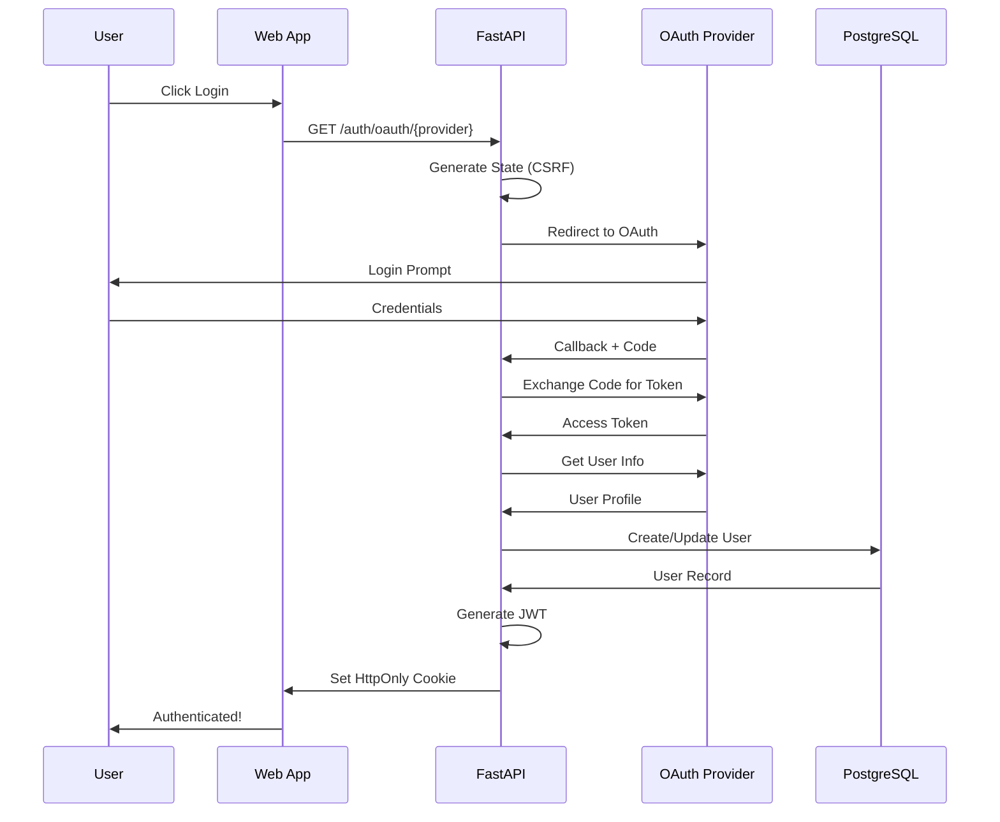
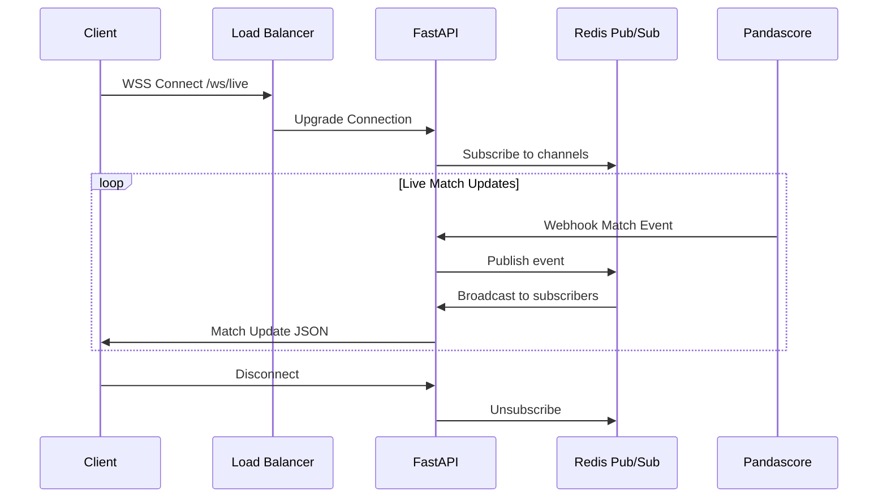
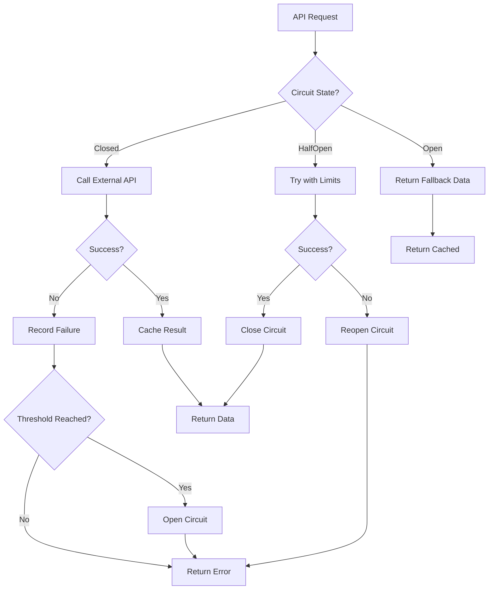
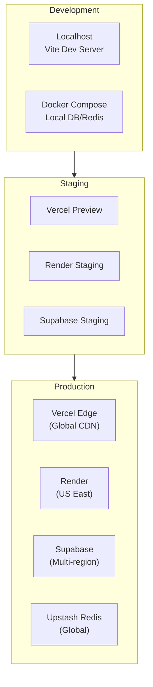

[Ver001.000] [Part: 1/1, Phase: 1/1, Progress: 100%, Status: Complete]

# System Architecture & Data Flow Diagram
## NJZiteGeisTe Platform - Visual Reference

---

## High-Level Architecture

---

## Data Flow: SATOR Analytics Pipeline

---

## Data Flow: ROTAS Simulation Pipeline

```mermaid
flowchart LR
    subgraph Input["🎯 Input"]
        Teams["Team Composition"]
        Maps["Map Selection"]
        Econ["Economy State"]
    end
    
    subgraph Engine["🎮 ROTAS Engine"]
        Sim["Match Simulation\nGodot/Deterministic"]
        Model["Outcome\nModeling"]
        CI["Confidence\nIntervals"]
    end
    
    subgraph Validation["✅ Validation"]
        Bench["VCT Benchmark\n>65% Accuracy"]
        Unit["Unit Tests\nGUT Framework"]
        Int["Integration\nAPI Tests"]
    end
    
    subgraph Output["📊 Output"]
        Predictions["Match Predictions"]
        XePlayer["X-ePlayer\nEmulation"]
        Viz["Visualizations\nLensing/MapView"]
    end
    
    Input --> Engine
    Engine --> Validation
    Validation --> Output
```

---

## SATOR/ROTAS Data Lineage

---

## Circuit Breaker State Machine

---

## Authentication Flow (TeXeT Layer)

---

## WebSocket Real-Time Flow

---

## Error Handling & Fallback Flow

---

## Deployment Architecture

---

*Document Version: 001.000*  
*Last Updated: 2026-03-30*
