[Ver001.000] [Part: 1/1, Phase: 2/3, Progress: 15%, Status: On-Going]

# Event Sourcing Architecture Implementation
## CDC/Event-Driven Pipeline for Real-Time Esports Data

---

## 1. EXECUTIVE SUMMARY

**Objective:** Replace polling-based scrapers with an event-driven architecture using Change Data Capture (CDC), message queues, and stream processing.

**Current State (Polling):**
```python
# Wasteful, high-latency polling
while True:
    scrape_vlr()  # Every 30s, 99% no changes
    time.sleep(30)
```

**Target State (Event-Driven):**
```
RiotAPI/Pandascore Webhook → Kafka → TimescaleDB → SimRating™ Recalc
```

**Benefits:**
- 90% reduction in API calls (cost savings)
- Sub-second latency (vs 30s polling)
- Better scalability and fault tolerance
- Audit trail of all data changes

---

## 2. ARCHITECTURE OVERVIEW

```mermaid
flowchart LR
    subgraph Sources["📡 Data Sources"]
        Pandascore["Pandascore API<br/>Webhooks"]
        Riot["Riot Games API<br/>Webhooks"]
        Manual["Manual Uploads<br/>Admin API"]
    end
    
    subgraph Ingestion["🔄 Event Ingestion"]
        API["API Gateway<br/>FastAPI"]
        Webhook["Webhook Receiver<br/>/v1/webhooks/*"]
        CDC["CDC Connector<br/>Debezium"]
    end
    
    subgraph Messaging["📨 Message Queue"]
        Kafka["Apache Kafka<br/>Event Stream"]
        Topics["Topics:<br/>- matches.raw<br/>- players.stats<br/>- events.live"]
    end
    
    subgraph Processing["⚙️ Stream Processing"]
        Faust["Faust/Python<br/>Stream Processors"]
        Transform["Transform &<br/>Validate"]
        Enrich["Enrich with<br/>Context"]
    end
    
    subgraph Storage["💾 Storage"]
        Timescale[("TimescaleDB<br/>Time-Series")]
        Postgres[("PostgreSQL<br/>Relational")]
        Redis[("Redis<br/>Cache/State")]
    end
    
    subgraph Consumers["👥 Consumers"]
        SimRating["SimRating™<br/>Recalc Engine"]
        WebSocket["WebSocket<br/>Broadcaster"]
        Analytics["Analytics<br/>Pipeline"]
    end
    
    Sources --> Ingestion --> Messaging --> Processing --> Storage --> Consumers
```



---

## 3. EVENT SCHEMA

### 3.1 Event Envelope (CloudEvents Standard)

```json
{
  "specversion": "1.0",
  "type": "com.njzitegeist.match.finished",
  "source": "pandascore.co",
  "id": "evt_a1b2c3d4e5f6",
  "time": "2026-03-30T12:00:00Z",
  "datacontenttype": "application/json",
  "data": {
    "match_id": "match_12345",
    "tournament": "VCT 2026 Masters",
    "team_a": "Team Liquid",
    "team_b": "Sentinels",
    "score_a": 13,
    "score_b": 11,
    "winner": "Team Liquid",
    "map": "Haven",
    "duration_seconds": 2340,
    "players": [...]
  },
  "metadata": {
    "ingestion_time": "2026-03-30T12:00:02Z",
    "processor_version": "2.1.0",
    "validation_hash": "sha256:abc123..."
  }
}
```

### 3.2 Event Types

| Event Type | Description | Producer | Consumers |
|------------|-------------|----------|-----------|
| `match.started` | Match begins | Pandascore | Live tracker |
| `match.finished` | Match complete | Pandascore | SimRating™, Analytics |
| `match.round_ended` | Round concluded | Riot API | Real-time odds |
| `player.stats_updated` | Player performance | Pandascore | SimRating™ |
| `tournament.created` | New tournament | Admin API | Notification svc |
| `odds.changed` | Betting odds update | Internal | Risk engine |

---

## 4. IMPLEMENTATION

### 4.1 Kafka Configuration

```yaml
# infrastructure/kafka/docker-compose.yml
version: '3.8'

services:
  zookeeper:
    image: confluentinc/cp-zookeeper:7.5.0
    environment:
      ZOOKEEPER_CLIENT_PORT: 2181
      ZOOKEEPER_TICK_TIME: 2000

  kafka:
    image: confluentinc/cp-kafka:7.5.0
    depends_on:
      - zookeeper
    ports:
      - "9092:9092"
    environment:
      KAFKA_BROKER_ID: 1
      KAFKA_ZOOKEEPER_CONNECT: zookeeper:2181
      KAFKA_ADVERTISED_LISTENERS: PLAINTEXT://localhost:9092
      KAFKA_OFFSETS_TOPIC_REPLICATION_FACTOR: 1
      KAFKA_AUTO_CREATE_TOPICS_ENABLE: "true"

  kafka-ui:
    image: provectuslabs/kafka-ui:latest
    ports:
      - "8080:8080"
    environment:
      KAFKA_CLUSTERS_0_NAME: local
      KAFKA_CLUSTERS_0_BOOTSTRAPSERVERS: kafka:9092
```

### 4.2 Webhook Receiver

```python
# packages/shared/api/src/events/webhook_receiver.py
"""
Webhook receiver for external event sources.
Implements idempotency and validation.
"""
from fastapi import APIRouter, Request, HTTPException, Depends
from fastapi.security import HTTPBearer, HTTPAuthorizationCredentials
import hashlib
import hmac
import json
from datetime import datetime
from typing import Dict, Any

from ..kafka.producer import KafkaProducer
from ..redis.cache import redis_client

router = APIRouter(prefix="/v1/webhooks")
security = HTTPBearer()

# Webhook secret configuration
WEBHOOK_SECRETS = {
    "pandascore": "pc_whsec_...",
    "riot": "riot_whsec_...",
}


async def verify_webhook_signature(
    request: Request,
    provider: str,
    signature: str
) -> bool:
    """Verify webhook HMAC signature."""
    secret = WEBHOOK_SECRETS.get(provider)
    if not secret:
        return False
    
    body = await request.body()
    expected = hmac.new(
        secret.encode(),
        body,
        hashlib.sha256
    ).hexdigest()
    
    return hmac.compare_digest(f"sha256={expected}", signature)


async def is_duplicate_event(event_id: str) -> bool:
    """Check if event was already processed (idempotency)."""
    key = f"webhook:processed:{event_id}"
    exists = await redis_client.get(key)
    if exists:
        return True
    
    # Mark as processed (TTL 24 hours)
    await redis_client.setex(key, 86400, "1")
    return False


@router.post("/pandascore")
async def receive_pandascore_webhook(
    request: Request,
    authorization: HTTPAuthorizationCredentials = Depends(security)
):
    """
    Receive Pandascore webhook events.
    
    Headers:
        X-Pandascore-Signature: HMAC signature
        X-Pandascore-Event-ID: Unique event ID
        X-Pandascore-Event-Type: Event type
    """
    # Verify signature
    signature = request.headers.get("X-Pandascore-Signature")
    if not await verify_webhook_signature(request, "pandascore", signature):
        raise HTTPException(status_code=401, detail="Invalid signature")
    
    # Parse event
    event_id = request.headers.get("X-Pandascore-Event-ID")
    event_type = request.headers.get("X-Pandascore-Event-Type")
    payload = await request.json()
    
    # Idempotency check
    if await is_duplicate_event(event_id):
        return {"status": "duplicate", "message": "Event already processed"}
    
    # Transform to CloudEvents format
    event = {
        "specversion": "1.0",
        "type": f"com.njzitegeist.{event_type}",
        "source": "pandascore.co",
        "id": event_id,
        "time": datetime.utcnow().isoformat() + "Z",
        "datacontenttype": "application/json",
        "data": payload,
    }
    
    # Publish to Kafka
    producer = KafkaProducer()
    topic = f"matches.{event_type.split('.')[0]}"
    await producer.send(topic, event)
    
    return {"status": "accepted", "event_id": event_id}


@router.post("/riot")
async def receive_riot_webhook(request: Request):
    """Receive Riot Games API webhook events."""
    # Similar implementation...
    pass
```

### 4.3 Kafka Producer

```python
# packages/shared/api/src/kafka/producer.py
"""
Async Kafka producer with connection pooling.
"""
from aiokafka import AIOKafkaProducer
from aiokafka.errors import KafkaError
import json
import logging
from typing import Any, Dict, Optional

logger = logging.getLogger(__name__)


class KafkaProducer:
    """Async Kafka producer singleton."""
    
    _instance = None
    _producer: Optional[AIOKafkaProducer] = None
    
    def __new__(cls):
        if cls._instance is None:
            cls._instance = super().__new__(cls)
        return cls._instance
    
    async def start(self):
        """Initialize producer connection."""
        if self._producer is None:
            self._producer = AIOKafkaProducer(
                bootstrap_servers="localhost:9092",
                value_serializer=lambda v: json.dumps(v).encode("utf-8"),
                key_serializer=lambda k: k.encode("utf-8") if k else None,
                compression_type="gzip",
                max_batch_size=16384,
                linger_ms=10,
            )
            await self._producer.start()
            logger.info("Kafka producer started")
    
    async def stop(self):
        """Graceful shutdown."""
        if self._producer:
            await self._producer.stop()
            self._producer = None
            logger.info("Kafka producer stopped")
    
    async def send(
        self,
        topic: str,
        value: Dict[str, Any],
        key: Optional[str] = None,
        headers: Optional[Dict[str, str]] = None
    ) -> bool:
        """
        Send message to Kafka topic.
        
        Args:
            topic: Target topic
            value: Message value (dict)
            key: Optional partition key
            headers: Optional message headers
            
        Returns:
            True if sent successfully
        """
        await self.start()
        
        try:
            future = await self._producer.send(
                topic,
                value=value,
                key=key,
                headers=[(k, v.encode()) for k, v in (headers or {}).items()]
            )
            
            # Wait for confirmation (optional, for critical events)
            record = await future
            logger.debug(f"Sent to {topic}, partition {record.partition}, offset {record.offset}")
            return True
            
        except KafkaError as e:
            logger.error(f"Failed to send to {topic}: {e}")
            return False
    
    async def send_batch(
        self,
        topic: str,
        messages: list[Dict[str, Any]],
        key_field: Optional[str] = None
    ) -> int:
        """
        Send batch of messages efficiently.
        
        Returns:
            Number of messages sent
        """
        await self.start()
        
        sent = 0
        for msg in messages:
            key = msg.get(key_field) if key_field else None
            success = await self.send(topic, msg, key=key)
            if success:
                sent += 1
        
        return sent


# FastAPI lifespan integration
async def kafka_lifespan(app):
    """Manage Kafka producer lifecycle."""
    producer = KafkaProducer()
    await producer.start()
    yield
    await producer.stop()
```

### 4.4 Stream Processor (Faust)

```python
# packages/shared/api/src/events/stream_processors.py
"""
Faust stream processors for real-time event handling.
"""
import faust
from datetime import datetime
from typing import Dict, Any

from ..database import get_db_pool
from ..simrating.engine import SimRatingEngine

# Faust application
app = faust.App(
    "njz-events",
    broker="kafka://localhost:9092",
    value_serializer="json",
)

# Topic definitions
matches_topic = app.topic("matches.raw", value_type=Dict[str, Any])
players_topic = app.topic("players.stats", value_type=Dict[str, Any])
simrating_topic = app.topic("simrating.recalc", value_type=Dict[str, Any])

# Table for stateful processing (player stats window)
player_stats_table = app.Table(
    "player_stats_window",
    default=lambda: {"matches": [], "last_update": None}
)


@app.agent(matches_topic)
async def process_match_events(stream):
    """
    Process match events and trigger downstream calculations.
    """
    async for event in stream:
        event_type = event.get("type", "")
        
        if "match.finished" in event_type:
            await handle_match_finished(event)
        elif "match.started" in event_type:
            await handle_match_started(event)


async def handle_match_finished(event: Dict[str, Any]):
    """
    Handle completed match:
    1. Store in TimescaleDB
    2. Trigger SimRating™ recalculation
    3. Update leaderboards
    """
    data = event.get("data", {})
    match_id = data.get("match_id")
    
    logger.info(f"Processing finished match: {match_id}")
    
    # 1. Store in database
    await store_match_result(data)
    
    # 2. Queue SimRating™ recalc for all players
    players = data.get("players", [])
    for player in players:
        await simrating_topic.send(value={
            "player_id": player["id"],
            "match_id": match_id,
            "trigger": "match_finished",
            "timestamp": datetime.utcnow().isoformat()
        })
    
    # 3. Update cache
    await invalidate_match_cache(match_id)


@app.agent(simrating_topic)
async def process_simrating_recalc(stream):
    """
    Process SimRating™ recalculation requests.
    """
    async for request in stream:
        player_id = request.get("player_id")
        
        # Calculate new rating
        engine = SimRatingEngine()
        result = await engine.calculate_for_player(player_id)
        
        # Store result
        await store_simrating_result(player_id, result)
        
        # Broadcast update via WebSocket
        await broadcast_rating_update(player_id, result)
        
        logger.info(f"Recalculated SimRating™ for {player_id}: {result['score']}")


# Windowed aggregation for player form
@app.agent(players_topic)
async def calculate_player_form(stream):
    """
    Calculate rolling player form (last 5 matches).
    """
    async for event in stream:
        player_id = event.get("player_id")
        stats = event.get("stats", {})
        
        # Get current window
        window = player_stats_table[player_id]
        
        # Add new match
        window["matches"].append(stats)
        window["last_update"] = datetime.utcnow().isoformat()
        
        # Keep only last 5
        if len(window["matches"]) > 5:
            window["matches"] = window["matches"][-5:]
        
        # Update table
        player_stats_table[player_id] = window
        
        # Calculate form score
        form_score = calculate_form_score(window["matches"])
        
        # Store in Redis for quick access
        await redis_client.setex(
            f"player:form:{player_id}",
            3600,  # 1 hour TTL
            json.dumps({"form": form_score, "matches": len(window["matches"])})
        )


def calculate_form_score(matches: list) -> float:
    """Calculate player form from last N matches."""
    if not matches:
        return 0.0
    
    # Weighted average (recent matches weighted higher)
    weights = [0.4, 0.3, 0.2, 0.07, 0.03][:len(matches)]
    scores = [m.get("performance_score", 0) for m in matches[-5:]]
    
    return sum(w * s for w, s in zip(weights, scores))
```

### 4.5 TimescaleDB Integration

```python
# packages/shared/api/src/database/timescale.py
"""
TimescaleDB integration for time-series data.
"""
from datetime import datetime
from typing import List, Dict, Any, Optional
import asyncpg

from .connection import get_db_pool


class TimescaleRepository:
    """Repository for time-series data in TimescaleDB."""
    
    async def create_hypertables(self):
        """Initialize hypertables for time-series data."""
        pool = await get_db_pool()
        
        async with pool.acquire() as conn:
            # Create hypertable for match events
            await conn.execute("""
                CREATE TABLE IF NOT EXISTS match_events (
                    time TIMESTAMPTZ NOT NULL,
                    match_id UUID,
                    event_type VARCHAR(50),
                    player_id UUID,
                    data JSONB,
                    PRIMARY KEY (time, match_id, event_type)
                );
            """)
            
            # Convert to hypertable
            await conn.execute("""
                SELECT create_hypertable('match_events', 'time', 
                    if_not_exists => TRUE,
                    chunk_time_interval => INTERVAL '1 day'
                );
            """)
            
            # Create hypertable for player performance
            await conn.execute("""
                CREATE TABLE IF NOT EXISTS player_performance (
                    time TIMESTAMPTZ NOT NULL,
                    player_id UUID,
                    match_id UUID,
                    combat_score FLOAT,
                    kda_ratio FLOAT,
                    acs FLOAT,
                    PRIMARY KEY (time, player_id, match_id)
                );
            """)
            
            await conn.execute("""
                SELECT create_hypertable('player_performance', 'time',
                    if_not_exists => TRUE,
                    chunk_time_interval => INTERVAL '7 days'
                );
            """)
    
    async def insert_match_event(
        self,
        match_id: str,
        event_type: str,
        timestamp: datetime,
        data: Dict[str, Any],
        player_id: Optional[str] = None
    ):
        """Insert match event into TimescaleDB."""
        pool = await get_db_pool()
        
        async with pool.acquire() as conn:
            await conn.execute("""
                INSERT INTO match_events (time, match_id, event_type, player_id, data)
                VALUES ($1, $2, $3, $4, $5)
                ON CONFLICT (time, match_id, event_type) DO NOTHING
            """, timestamp, match_id, event_type, player_id, json.dumps(data))
    
    async def get_player_time_series(
        self,
        player_id: str,
        start: datetime,
        end: datetime,
        metric: str = "combat_score"
    ) -> List[Dict[str, Any]]:
        """
        Query player performance time series.
        
        Uses TimescaleDB time_bucket for efficient aggregation.
        """
        pool = await get_db_pool()
        
        async with pool.acquire() as conn:
            rows = await conn.fetch("""
                SELECT 
                    time_bucket('1 hour', time) as bucket,
                    AVG({metric}) as avg_value,
                    MAX({metric}) as max_value,
                    COUNT(*) as match_count
                FROM player_performance
                WHERE player_id = $1
                  AND time BETWEEN $2 AND $3
                GROUP BY bucket
                ORDER BY bucket DESC
            """.format(metric=metric), player_id, start, end)
            
            return [dict(row) for row in rows]
    
    async def get_recent_performance(
        self,
        player_id: str,
        matches: int = 5
    ) -> List[Dict[str, Any]]:
        """Get player's last N matches performance."""
        pool = await get_db_pool()
        
        async with pool.acquire() as conn:
            rows = await conn.fetch("""
                SELECT *
                FROM player_performance
                WHERE player_id = $1
                ORDER BY time DESC
                LIMIT $2
            """, player_id, matches)
            
            return [dict(row) for row in rows]
```

---

## 5. MIGRATION PLAN

### Phase 1: Infrastructure (Week 1-2)
- [ ] Deploy Kafka cluster
- [ ] Set up TimescaleDB
- [ ] Configure webhook endpoints
- [ ] Implement CDC connectors

### Phase 2: Event Pipeline (Week 3-4)
- [ ] Implement webhook receivers
- [ ] Deploy stream processors
- [ ] Set up idempotency layer
- [ ] Configure monitoring

### Phase 3: Migration (Week 5-6)
- [ ] Run polling and event-driven in parallel
- [ ] Validate data consistency
- [ ] Switch traffic to event-driven
- [ ] Deprecate polling scrapers

### Phase 4: Optimization (Week 7-8)
- [ ] Tune Kafka partitions
- [ ] Optimize TimescaleDB chunks
- [ ] Implement advanced windowing
- [ ] Add predictive analytics

---

## 6. MONITORING & ALERTING

### Key Metrics

| Metric | Target | Alert |
|--------|--------|-------|
| Event latency (p99) | <500ms | >1s |
| Kafka lag | <1000 messages | >5000 |
| Processing errors | <0.1% | >1% |
| TimescaleDB insert rate | >10K/sec | <5K/sec |

### Alerts

```yaml
# Prometheus alerting rules
groups:
  - name: event-pipeline
    rules:
      - alert: HighKafkaLag
        expr: kafka_consumer_group_lag > 5000
        for: 5m
        labels:
          severity: warning
        annotations:
          summary: "Kafka consumer lag is high"
          
      - alert: EventProcessingErrors
        expr: rate(event_processing_errors[5m]) > 0.01
        for: 2m
        labels:
          severity: critical
```

---

## 7. DOCUMENT CONTROL

| Version | Date | Author | Changes |
|---------|------|--------|---------|
| 001.000 | 2026-03-30 | Data Engineering | Initial implementation plan |

---

*End of Event Sourcing Architecture Implementation*
