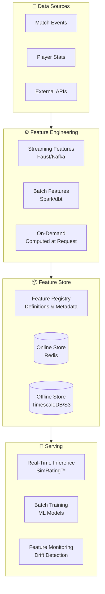

[Ver001.000] [Part: 1/1, Phase: 2/3, Progress: 10%, Status: On-Going]

# Feature Store & ML Infrastructure
## Tecton-Style Feature Registry with Online/Offline Separation

---

## 1. EXECUTIVE SUMMARY

**Objective:** Implement a production-grade feature store supporting real-time inference and batch training with feature versioning and backfill capability.

**Key Capabilities:**
- **Online features** → Redis (sub-10ms latency for real-time inference)
- **Offline features** → TimescaleDB (historical aggregates for training)
- **Feature versioning** with backfill capability
- **Tecton-style** feature registry and serving

---

## 2. ARCHITECTURE



---

## 3. FEATURE DEFINITIONS

### 3.1 Feature Registry

```python
# packages/shared/ml/features/registry.py
"""
Feature registry with versioning and metadata.
Tecton-style feature definitions.
"""
from dataclasses import dataclass, field
from datetime import datetime, timedelta
from enum import Enum
from typing import Callable, List, Optional, Dict, Any
import hashlib


class FeatureType(Enum):
    """Feature computation type."""
    STREAMING = "streaming"  # Real-time updates
    BATCH = "batch"          # Scheduled computation
    ON_DEMAND = "on_demand"  # Computed at request time


class FeatureStore(Enum):
    """Storage backend for feature."""
    ONLINE = "online"      # Redis (fast lookup)
    OFFLINE = "offline"    # TimescaleDB (historical)
    BOTH = "both"          # Dual write


@dataclass
class FeatureDefinition:
    """
    Definition of a feature in the registry.
    
    Example:
        FeatureDefinition(
            name="player_combat_score_avg_7d",
            entity="player",
            feature_type=FeatureType.STREAMING,
            stores=[FeatureStore.BOTH],
            ttl=timedelta(days=7),
            schema={"value": "float", "timestamp": "datetime"}
        )
    """
    name: str
    description: str
    entity: str  # player, team, match
    feature_type: FeatureType
    stores: List[FeatureStore]
    ttl: Optional[timedelta] = None
    schema: Dict[str, str] = field(default_factory=dict)
    version: str = "1.0.0"
    owner: str = "ml-team"
    tags: List[str] = field(default_factory=list)
    
    def __post_init__(self):
        self.created_at = datetime.utcnow()
        self.fingerprint = self._compute_fingerprint()
    
    def _compute_fingerprint(self) -> str:
        """Compute unique fingerprint for feature versioning."""
        content = f"{self.name}:{self.version}:{sorted(self.schema.items())}"
        return hashlib.sha256(content.encode()).hexdigest()[:16]


class FeatureRegistry:
    """Central registry for all feature definitions."""
    
    def __init__(self):
        self._features: Dict[str, FeatureDefinition] = {}
    
    def register(self, feature: FeatureDefinition) -> None:
        """Register a new feature definition."""
        if feature.name in self._features:
            existing = self._features[feature.name]
            if existing.fingerprint != feature.fingerprint:
                raise ValueError(
                    f"Feature {feature.name} already exists with different schema. "
                    f"Bump version to register new version."
                )
        
        self._features[feature.name] = feature
        print(f"✅ Registered feature: {feature.name} v{feature.version}")
    
    def get(self, name: str) -> Optional[FeatureDefinition]:
        """Get feature definition by name."""
        return self._features.get(name)
    
    def list_features(
        self,
        entity: Optional[str] = None,
        feature_type: Optional[FeatureType] = None,
        tag: Optional[str] = None
    ) -> List[FeatureDefinition]:
        """List features with optional filtering."""
        features = list(self._features.values())
        
        if entity:
            features = [f for f in features if f.entity == entity]
        if feature_type:
            features = [f for f in features if f.feature_type == feature_type]
        if tag:
            features = [f for f in features if tag in f.tags]
        
        return features
    
    def get_feature_set(self, names: List[str]) -> Dict[str, FeatureDefinition]:
        """Get multiple features as a feature set."""
        return {name: self._features[name] for name in names if name in self._features}


# Global registry instance
registry = FeatureRegistry()
```

### 3.2 Feature Definitions

```python
# packages/shared/ml/features/definitions.py
"""
Feature definitions for esports analytics.
"""
from datetime import timedelta

from .registry import FeatureDefinition, FeatureType, FeatureStore, registry


# ==================== Player Features ====================

PLAYER_COMBAT_SCORE_7D = FeatureDefinition(
    name="player_combat_score_avg_7d",
    description="Average combat score over last 7 days",
    entity="player",
    feature_type=FeatureType.STREAMING,
    stores=[FeatureStore.BOTH],
    ttl=timedelta(days=7),
    schema={"value": "float", "match_count": "int", "timestamp": "datetime"},
    tags=["combat", "performance", "player"]
)
registry.register(PLAYER_COMBAT_SCORE_7D)

PLAYER_KDA_RATIO_30D = FeatureDefinition(
    name="player_kda_ratio_30d",
    description="Kill/Death/Assist ratio over last 30 days",
    entity="player",
    feature_type=FeatureType.BATCH,
    stores=[FeatureStore.OFFLINE],
    ttl=timedelta(days=30),
    schema={"value": "float", "kills": "int", "deaths": "int", "assists": "int"},
    tags=["combat", "performance", "player"]
)
registry.register(PLAYER_KDA_RATIO_30D)

PLAYER_FORM_TREND = FeatureDefinition(
    name="player_form_trend",
    description="Performance trend (improving/stable/declining)",
    entity="player",
    feature_type=FeatureType.ON_DEMAND,
    stores=[FeatureStore.ONLINE],
    schema={"value": "string", "slope": "float", "confidence": "float"},
    tags=["trend", "performance", "player"]
)
registry.register(PLAYER_FORM_TREND)

PLAYER_HEADSHOT_PCT = FeatureDefinition(
    name="player_headshot_percentage",
    description="Headshot percentage across all matches",
    entity="player",
    feature_type=FeatureType.STREAMING,
    stores=[FeatureStore.BOTH],
    ttl=timedelta(days=90),
    schema={"value": "float", "total_kills": "int", "headshot_kills": "int"},
    tags=["precision", "performance", "player"]
)
registry.register(PLAYER_HEADSHOT_PCT)


# ==================== Team Features ====================

TEAM_WIN_RATE_14D = FeatureDefinition(
    name="team_win_rate_14d",
    description="Team win rate over last 14 days",
    entity="team",
    feature_type=FeatureType.STREAMING,
    stores=[FeatureStore.BOTH],
    ttl=timedelta(days=14),
    schema={"value": "float", "wins": "int", "losses": "int"},
    tags=["team", "performance", "winrate"]
)
registry.register(TEAM_WIN_RATE_14D)

TEAM_MAP_WIN_RATES = FeatureDefinition(
    name="team_map_win_rates",
    description="Win rates per map (JSON blob)",
    entity="team",
    feature_type=FeatureType.BATCH,
    stores=[FeatureStore.OFFLINE],
    ttl=timedelta(days=30),
    schema={"value": "json", "maps_played": "int"},
    tags=["team", "map", "performance"]
)
registry.register(TEAM_MAP_WIN_RATES)

TEAM_ECONOMY_EFFICIENCY = FeatureDefinition(
    name="team_economy_efficiency",
    description="Credits spent per round won",
    entity="team",
    feature_type=FeatureType.STREAMING,
    stores=[FeatureStore.ONLINE],
    ttl=timedelta(days=7),
    schema={"value": "float", "total_credits": "int", "rounds_won": "int"},
    tags=["team", "economy", "efficiency"]
)
registry.register(TEAM_ECONOMY_EFFICIENCY)


# ==================== Match Features ====================

MATCH_H2H_HISTORY = FeatureDefinition(
    name="match_head_to_head_history",
    description="Historical matchups between teams",
    entity="match",
    feature_type=FeatureType.ON_DEMAND,
    stores=[FeatureStore.OFFLINE],
    schema={
        "total_matches": "int",
        "team_a_wins": "int",
        "team_b_wins": "int",
        "avg_score_diff": "float"
    },
    tags=["match", "h2h", "history"]
)
registry.register(MATCH_H2H_HISTORY)

MATCH_ODDS_MOVEMENT = FeatureDefinition(
    name="match_odds_movement",
    description="How odds have shifted pre-match",
    entity="match",
    feature_type=FeatureType.STREAMING,
    stores=[FeatureStore.ONLINE],
    ttl=timedelta(hours=24),
    schema={"open_odds": "float", "current_odds": "float", "movement_pct": "float"},
    tags=["match", "odds", "market"]
)
registry.register(MATCH_ODDS_MOVEMENT)
```

---

## 4. FEATURE COMPUTATION

### 4.1 Streaming Features (Faust)

```python
# packages/shared/ml/features/compute/streaming.py
"""
Streaming feature computation using Faust/Kafka.
"""
import faust
from datetime import datetime
from statistics import mean

from ..registry import registry, FeatureStore
from ...redis.cache import redis_client
from ...database.timescale import TimescaleRepository

app = faust.App(
    "feature-computation",
    broker="kafka://localhost:9092",
)

# Input topics
player_stats_topic = app.topic("features.player.stats", value_type=dict)
match_results_topic = app.topic("features.match.results", value_type=dict)

# Tables for stateful computation
player_7d_window = app.Table(
    "player_7d_window",
    default=lambda: {"scores": [], "last_update": None}
)


@app.agent(player_stats_topic)
async def compute_player_7d_features(stream):
    """
    Compute 7-day rolling features for players.
    """
    async for event in stream:
        player_id = event["player_id"]
        combat_score = event["combat_score"]
        timestamp = datetime.fromisoformat(event["timestamp"])
        
        # Get current window
        window = player_7d_window[player_id]
        
        # Add new score with timestamp
        window["scores"].append({
            "score": combat_score,
            "timestamp": timestamp
        })
        
        # Remove scores older than 7 days
        cutoff = timestamp - timedelta(days=7)
        window["scores"] = [
            s for s in window["scores"]
            if s["timestamp"] > cutoff
        ]
        
        window["last_update"] = timestamp.isoformat()
        player_7d_window[player_id] = window
        
        # Compute aggregate
        if window["scores"]:
            avg_score = mean(s["score"] for s in window["scores"])
            
            # Write to online store (Redis)
            feature_key = f"feature:player_combat_score_avg_7d:{player_id}"
            await redis_client.hset(feature_key, mapping={
                "value": str(avg_score),
                "match_count": len(window["scores"]),
                "timestamp": timestamp.isoformat()
            })
            await redis_client.expire(feature_key, 7 * 24 * 3600)
            
            # Write to offline store (TimescaleDB)
            timescale = TimescaleRepository()
            await timescale.insert_feature(
                feature_name="player_combat_score_avg_7d",
                entity_type="player",
                entity_id=player_id,
                timestamp=timestamp,
                value={"value": avg_score, "match_count": len(window["scores"])}
            )
```

### 4.2 Batch Features (dbt)

```sql
-- dbt/models/features/player_kda_ratio_30d.sql
{{ config(
    materialized='incremental',
    unique_key=['player_id', 'date'],
    partition_by={
        "field": "date",
        "data_type": "date",
        "granularity": "day"
    }
) }}

WITH daily_stats AS (
    SELECT
        player_id,
        DATE(created_at) as date,
        SUM(kills) as kills,
        SUM(deaths) as deaths,
        SUM(assists) as assists
    FROM {{ ref('player_match_stats') }}
    WHERE created_at >= CURRENT_DATE - INTERVAL '30 days'
    
        AND created_at > (SELECT MAX(date) FROM {{ this }})
    
    GROUP BY 1, 2
),
rolling_30d AS (
    SELECT
        player_id,
        date,
        SUM(kills) OVER (
            PARTITION BY player_id
            ORDER BY date
            ROWS BETWEEN 29 PRECEDING AND CURRENT ROW
        ) as kills_30d,
        SUM(deaths) OVER (
            PARTITION BY player_id
            ORDER BY date
            ROWS BETWEEN 29 PRECEDING AND CURRENT ROW
        ) as deaths_30d,
        SUM(assists) OVER (
            PARTITION BY player_id
            ORDER BY date
            ROWS BETWEEN 29 PRECEDING AND CURRENT ROW
        ) as assists_30d
    FROM daily_stats
)
SELECT
    player_id,
    date,
    kills_30d,
    deaths_30d,
    assists_30d,
    CASE 
        WHEN deaths_30d = 0 THEN kills_30d::float
        ELSE (kills_30d + assists_30d * 0.5) / deaths_30d::float
    END as kda_ratio,
    CURRENT_TIMESTAMP as computed_at
FROM rolling_30d
```

### 4.3 On-Demand Features

```python
# packages/shared/ml/features/compute/on_demand.py
"""
On-demand feature computation at request time.
"""
from typing import Dict, Any, List
from datetime import datetime, timedelta
from statistics import linregress

from ...database import get_db_pool


class OnDemandFeatureComputer:
    """Compute features on-demand for real-time inference."""
    
    async def compute_player_form_trend(
        self,
        player_id: str,
        lookback_matches: int = 10
    ) -> Dict[str, Any]:
        """
        Compute player form trend (improving/stable/declining).
        
        Uses linear regression on recent performance scores.
        """
        pool = await get_db_pool()
        
        async with pool.acquire() as conn:
            rows = await conn.fetch("""
                SELECT 
                    match_date,
                    performance_score
                FROM player_match_performance
                WHERE player_id = $1
                ORDER BY match_date DESC
                LIMIT $2
            """, player_id, lookback_matches)
        
        if len(rows) < 5:
            return {
                "value": "insufficient_data",
                "slope": 0.0,
                "confidence": 0.0
            }
        
        # Prepare data for regression
        dates = [i for i in range(len(rows))]
        scores = [r["performance_score"] for r in rows]
        
        # Calculate trend
        slope, intercept, r_value, p_value, std_err = linregress(dates, scores)
        
        # Determine trend category
        if abs(slope) < 0.5:
            trend = "stable"
        elif slope > 0:
            trend = "improving"
        else:
            trend = "declining"
        
        return {
            "value": trend,
            "slope": slope,
            "r_squared": r_value ** 2,
            "confidence": 1 - p_value if p_value else 0,
            "matches_analyzed": len(rows)
        }
    
    async def compute_match_h2h_history(
        self,
        team_a_id: str,
        team_b_id: str
    ) -> Dict[str, Any]:
        """Compute head-to-head history between two teams."""
        pool = await get_db_pool()
        
        async with pool.acquire() as conn:
            rows = await conn.fetch("""
                SELECT 
                    winner_id,
                    team_a_score,
                    team_b_score
                FROM matches
                WHERE (team_a_id = $1 AND team_b_id = $2)
                   OR (team_a_id = $2 AND team_b_id = $1)
                ORDER BY match_date DESC
                LIMIT 20
            """, team_a_id, team_b_id)
        
        if not rows:
            return {
                "total_matches": 0,
                "team_a_wins": 0,
                "team_b_wins": 0,
                "avg_score_diff": 0
            }
        
        team_a_wins = sum(1 for r in rows if r["winner_id"] == team_a_id)
        team_b_wins = sum(1 for r in rows if r["winner_id"] == team_b_id)
        
        score_diffs = []
        for r in rows:
            diff = abs(r["team_a_score"] - r["team_b_score"])
            score_diffs.append(diff)
        
        return {
            "total_matches": len(rows),
            "team_a_wins": team_a_wins,
            "team_b_wins": team_b_wins,
            "avg_score_diff": sum(score_diffs) / len(score_diffs),
            "recent_form": "team_a" if team_a_wins > team_b_wins else "team_b"
        }
```

---

## 5. FEATURE SERVING

### 5.1 Online Feature Store (Redis)

```python
# packages/shared/ml/features/serving/online.py
"""
Online feature serving with low-latency Redis lookups.
"""
from typing import Dict, List, Optional, Any
from datetime import datetime
import asyncio

from ...redis.cache import redis_client
from ..registry import FeatureDefinition, FeatureStore


class OnlineFeatureStore:
    """
    Serve features from Redis for real-time inference.
    Target latency: <10ms p99
    """
    
    async def get_feature(
        self,
        feature_name: str,
        entity_type: str,
        entity_id: str
    ) -> Optional[Dict[str, Any]]:
        """
        Get single feature value.
        
        Args:
            feature_name: Name of feature in registry
            entity_type: Entity type (player, team, match)
            entity_id: Entity identifier
            
        Returns:
            Feature value dict or None if not found
        """
        key = f"feature:{feature_name}:{entity_id}"
        data = await redis_client.hgetall(key)
        
        if not data:
            return None
        
        # Parse types based on schema
        return self._parse_feature_data(feature_name, data)
    
    async def get_features(
        self,
        feature_names: List[str],
        entity_type: str,
        entity_id: str
    ) -> Dict[str, Any]:
        """
        Get multiple features in single round-trip.
        
        Uses Redis pipeline for efficiency.
        """
        pipe = redis_client.pipeline()
        
        for name in feature_names:
            key = f"feature:{name}:{entity_id}"
            pipe.hgetall(key)
        
        results = await pipe.execute()
        
        features = {}
        for name, result in zip(feature_names, results):
            if result:
                features[name] = self._parse_feature_data(name, result)
        
        return features
    
    async def get_feature_vector(
        self,
        feature_set: List[str],
        entities: List[tuple[str, str]]  # [(type, id), ...]
    ) -> List[Dict[str, Any]]:
        """
        Get feature vectors for multiple entities (batch lookup).
        
        Used for batch inference.
        """
        tasks = [
            self.get_features(feature_set, etype, eid)
            for etype, eid in entities
        ]
        
        return await asyncio.gather(*tasks)
    
    def _parse_feature_data(
        self,
        feature_name: str,
        data: Dict[str, str]
    ) -> Dict[str, Any]:
        """Parse feature data according to schema."""
        from ..registry import registry
        
        definition = registry.get(feature_name)
        if not definition:
            return data
        
        parsed = {}
        for key, value in data.items():
            schema_type = definition.schema.get(key, "string")
            
            if schema_type == "float":
                parsed[key] = float(value)
            elif schema_type == "int":
                parsed[key] = int(value)
            elif schema_type == "json":
                parsed[key] = json.loads(value)
            else:
                parsed[key] = value
        
        return parsed


# FastAPI dependency
async def get_online_features(
    entity_type: str,
    entity_id: str,
    feature_names: List[str]
) -> Dict[str, Any]:
    """Dependency to fetch online features for inference."""
    store = OnlineFeatureStore()
    return await store.get_features(feature_names, entity_type, entity_id)
```

### 5.2 Offline Feature Store (TimescaleDB)

```python
# packages/shared/ml/features/serving/offline.py
"""
Offline feature serving for batch training.
"""
from typing import List, Dict, Any, Optional
from datetime import datetime, timedelta
import pandas as pd

from ...database.timescale import TimescaleRepository


class OfflineFeatureStore:
    """
    Serve historical features for model training.
    Retrieves point-in-time correct feature values.
    """
    
    async def get_features_at_time(
        self,
        feature_names: List[str],
        entity_type: str,
        entity_ids: List[str],
        timestamp: datetime
    ) -> pd.DataFrame:
        """
        Get feature values as they existed at specific timestamp.
        
        Critical for preventing data leakage in training.
        """
        timescale = TimescaleRepository()
        
        results = []
        for feature_name in feature_names:
            rows = await timescale.get_feature_at_time(
                feature_name=feature_name,
                entity_type=entity_type,
                entity_ids=entity_ids,
                timestamp=timestamp
            )
            results.extend(rows)
        
        # Convert to DataFrame
        df = pd.DataFrame(results)
        
        # Pivot to wide format
        if not df.empty:
            df = df.pivot(
                index=['entity_id', 'timestamp'],
                columns='feature_name',
                values='value'
            ).reset_index()
        
        return df
    
    async def get_feature_range(
        self,
        feature_name: str,
        entity_type: str,
        entity_id: str,
        start: datetime,
        end: datetime
    ) -> pd.DataFrame:
        """Get feature values over time range."""
        timescale = TimescaleRepository()
        
        rows = await timescale.query_feature_range(
            feature_name=feature_name,
            entity_type=entity_type,
            entity_id=entity_id,
            start=start,
            end=end
        )
        
        return pd.DataFrame(rows)
    
    async def generate_training_dataset(
        self,
        label_query: str,
        feature_set: List[str],
        lookback_window: timedelta = timedelta(days=30)
    ) -> pd.DataFrame:
        """
        Generate training dataset with point-in-time correctness.
        
        Args:
            label_query: SQL query returning (entity_id, timestamp, label)
            feature_set: List of feature names to include
            lookback_window: How far back to look for features
        """
        # Get labels
        labels = await self._execute_query(label_query)
        
        # For each label, get features at that time
        feature_rows = []
        for label in labels:
            feature_time = label["timestamp"] - lookback_window
            
            features = await self.get_features_at_time(
                feature_names=feature_set,
                entity_type=label["entity_type"],
                entity_ids=[label["entity_id"]],
                timestamp=feature_time
            )
            
            if not features.empty:
                features["label"] = label["label"]
                feature_rows.append(features)
        
        return pd.concat(feature_rows, ignore_index=True)
```

---

## 6. FEATURE MONITORING

```python
# packages/shared/ml/features/monitoring.py
"""
Feature monitoring and drift detection.
"""
from typing import Dict, Any, List
from datetime import datetime, timedelta
from statistics import mean, stdev

from ...database import get_db_pool


class FeatureMonitor:
    """Monitor feature health and detect drift."""
    
    DRIFT_THRESHOLD = 3.0  # Standard deviations
    
    async def check_feature_health(
        self,
        feature_name: str,
        window_hours: int = 24
    ) -> Dict[str, Any]:
        """
        Check feature freshness and distribution.
        """
        pool = await get_db_pool()
        
        async with pool.acquire() as conn:
            # Get recent values
            rows = await conn.fetch("""
                SELECT 
                    (value->>'value')::float as val,
                    timestamp
                FROM feature_store
                WHERE feature_name = $1
                  AND timestamp > NOW() - INTERVAL '$2 hours'
                ORDER BY timestamp DESC
            """, feature_name, window_hours)
        
        if len(rows) < 10:
            return {
                "feature": feature_name,
                "status": "insufficient_data",
                "sample_count": len(rows)
            }
        
        values = [r["val"] for r in rows]
        
        # Calculate statistics
        current_mean = mean(values)
        current_std = stdev(values) if len(values) > 1 else 0
        
        # Compare to historical baseline
        baseline = await self._get_baseline(feature_name)
        
        if baseline:
            drift_score = abs(current_mean - baseline["mean"]) / baseline["std"]
            
            if drift_score > self.DRIFT_THRESHOLD:
                status = "drift_detected"
            else:
                status = "healthy"
        else:
            drift_score = None
            status = "no_baseline"
        
        return {
            "feature": feature_name,
            "status": status,
            "sample_count": len(rows),
            "current_mean": current_mean,
            "current_std": current_std,
            "baseline_mean": baseline["mean"] if baseline else None,
            "drift_score": drift_score,
            "freshness_minutes": (
                datetime.utcnow() - rows[0]["timestamp"]
            ).total_seconds() / 60 if rows else None
        }
    
    async def _get_baseline(self, feature_name: str) -> Dict[str, float]:
        """Get historical baseline for feature."""
        # Implementation would query historical stats
        pass
```

---

## 7. DOCUMENT CONTROL

| Version | Date | Author | Changes |
|---------|------|--------|---------|
| 001.000 | 2026-03-30 | ML Team | Feature store implementation plan |

---

*End of Feature Store & ML Infrastructure*
